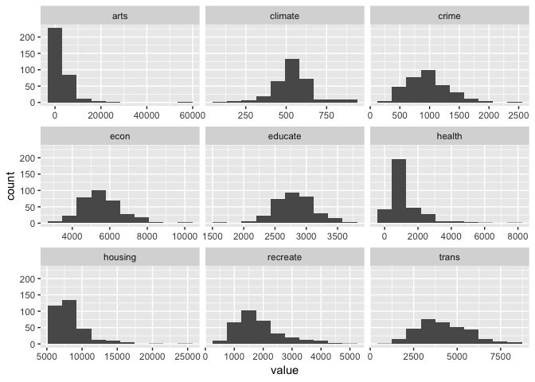
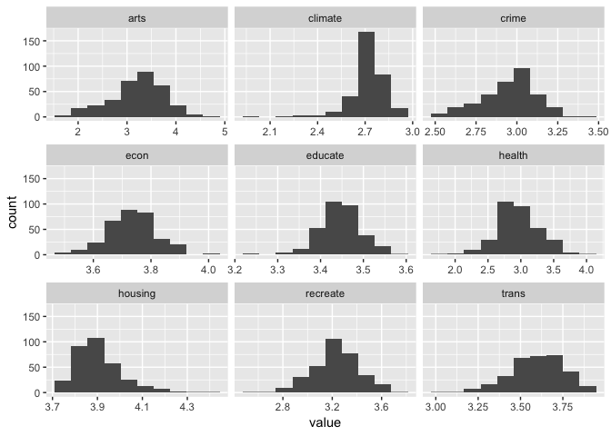
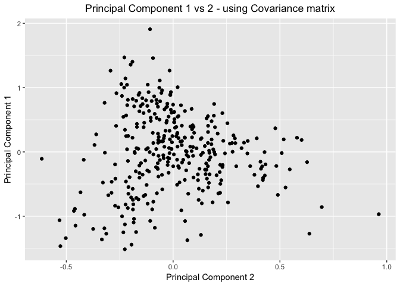
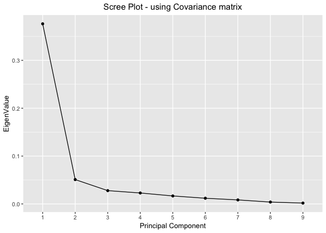
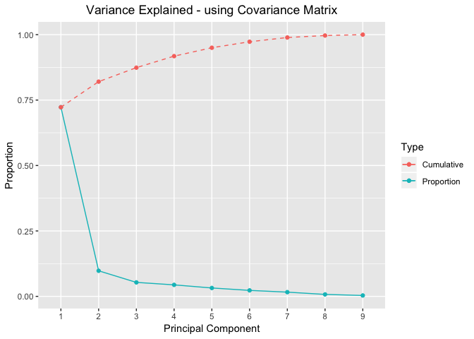
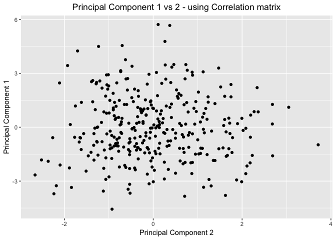
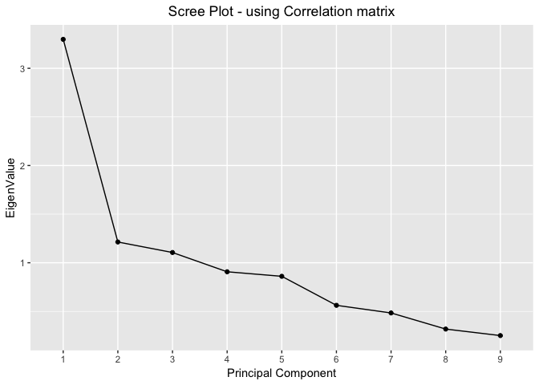
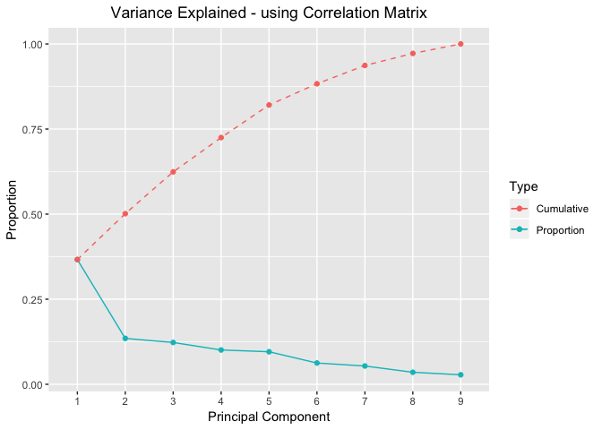

STAT 505 - Lesson 11 - Principal Component Analysis
================
Ramaa Nathan
4/3/2019

-   [Data Exploration](#data-exploration)
    -   [Load File](#load-file)
    -   [Plot histograms](#plot-histograms)
    -   [Transform to normalize data](#transform-to-normalize-data)
    -   [Plot transformed histograms](#plot-transformed-histograms)
-   [Principal Component Analysis using Covariance Matrix](#principal-component-analysis-using-covariance-matrix)
    -   [Using princomp](#using-princomp)
        -   [Scatter Plots of the Principal Components - using Covariance Matrix](#scatter-plots-of-the-principal-components---using-covariance-matrix)
        -   [Scree Plots - using Covariance Matrix](#scree-plots---using-covariance-matrix)
        -   [Variance Explained Plots - using Covariance Matrix](#variance-explained-plots---using-covariance-matrix)
        -   [Correlation between Principal Components and Variables -using Covariance Matrix](#correlation-between-principal-components-and-variables--using-covariance-matrix)
    -   [Using prcomp](#using-prcomp)
-   [Principal Component Analysis using Correlation Matrix - Standardized values](#principal-component-analysis-using-correlation-matrix---standardized-values)
    -   [Scatter Plots of the Principal Components - using Correlation Matrix](#scatter-plots-of-the-principal-components---using-correlation-matrix)
    -   [Scree Plots - using Correlation Matrix](#scree-plots---using-correlation-matrix)
    -   [Variance Explained Plots -using Correlation Matrix](#variance-explained-plots--using-correlation-matrix)
    -   [Correlation between Principal Components and Variables - using Correlation Matrix](#correlation-between-principal-components-and-variables---using-correlation-matrix)

Data Exploration
----------------

### Load File

``` r
places = read_table("data/places.txt", col_names=c("climate", "housing","health","crime","trans","educate","arts","recreate","econ","id") )
```

    ## Parsed with column specification:
    ## cols(
    ##   climate = col_integer(),
    ##   housing = col_integer(),
    ##   health = col_integer(),
    ##   crime = col_integer(),
    ##   trans = col_integer(),
    ##   educate = col_integer(),
    ##   arts = col_integer(),
    ##   recreate = col_integer(),
    ##   econ = col_integer(),
    ##   id = col_integer()
    ## )

``` r
#str(places)
```

### Plot histograms

``` r
ggplot(gather(places[,-10]),aes(value)) +
  geom_histogram(bins=10) +
  facet_wrap(~key, scales='free_x')
```



### Transform to normalize data

``` r
#apply log10 function - we do not need id here.. so remove it.
#places1 = places %>% select(-id) %>%
 # mutate_all(log10)
places1 <- places %>% 
  mutate_at(vars(-id),log10)
```

### Plot transformed histograms

``` r
ggplot(gather(places1[,-10]),aes(value)) +
  geom_histogram(bins=10) +
  facet_wrap(~key, scales='free_x')
```



``` r
formatAsTable <- function(df,title="Title") {
  #create the header vector
  table_header = ifelse(has_rownames(df),c(ncol(df)+1),c(ncol(df)))
  names(table_header)=c(title)
  #style the table
  df %>% kable() %>%
    kable_styling(full_width=F,bootstrap_options=c("bordered")) %>%
    add_header_above(table_header)
}
```

Principal Component Analysis using Covariance Matrix
----------------------------------------------------

### Using princomp

``` r
#get the covariance matrix
places_cov <- cov(places1[,-10])
formatAsTable(data.frame(places_cov),"Covariance Matrix")
```

<table class="table table-bordered" style="width: auto !important; margin-left: auto; margin-right: auto;">
<thead>
<tr>
<th style="border-bottom:hidden; padding-bottom:0; padding-left:3px;padding-right:3px;text-align: center; " colspan="10">
Covariance Matrix

</th>
</tr>
<tr>
<th style="text-align:left;">
</th>
<th style="text-align:right;">
climate
</th>
<th style="text-align:right;">
housing
</th>
<th style="text-align:right;">
health
</th>
<th style="text-align:right;">
crime
</th>
<th style="text-align:right;">
trans
</th>
<th style="text-align:right;">
educate
</th>
<th style="text-align:right;">
arts
</th>
<th style="text-align:right;">
recreate
</th>
<th style="text-align:right;">
econ
</th>
</tr>
</thead>
<tbody>
<tr>
<td style="text-align:left;">
climate
</td>
<td style="text-align:right;">
0.0128923
</td>
<td style="text-align:right;">
0.0032678
</td>
<td style="text-align:right;">
0.0054793
</td>
<td style="text-align:right;">
0.0043741
</td>
<td style="text-align:right;">
0.0003857
</td>
<td style="text-align:right;">
0.0004415
</td>
<td style="text-align:right;">
0.0106886
</td>
<td style="text-align:right;">
0.0025733
</td>
<td style="text-align:right;">
-0.0009662
</td>
</tr>
<tr>
<td style="text-align:left;">
housing
</td>
<td style="text-align:right;">
0.0032678
</td>
<td style="text-align:right;">
0.0111161
</td>
<td style="text-align:right;">
0.0145962
</td>
<td style="text-align:right;">
0.0024831
</td>
<td style="text-align:right;">
0.0052786
</td>
<td style="text-align:right;">
0.0010696
</td>
<td style="text-align:right;">
0.0292263
</td>
<td style="text-align:right;">
0.0091270
</td>
<td style="text-align:right;">
0.0026458
</td>
</tr>
<tr>
<td style="text-align:left;">
health
</td>
<td style="text-align:right;">
0.0054793
</td>
<td style="text-align:right;">
0.0145962
</td>
<td style="text-align:right;">
0.1027279
</td>
<td style="text-align:right;">
0.0099550
</td>
<td style="text-align:right;">
0.0211535
</td>
<td style="text-align:right;">
0.0074778
</td>
<td style="text-align:right;">
0.1184844
</td>
<td style="text-align:right;">
0.0152994
</td>
<td style="text-align:right;">
0.0014634
</td>
</tr>
<tr>
<td style="text-align:left;">
crime
</td>
<td style="text-align:right;">
0.0043741
</td>
<td style="text-align:right;">
0.0024831
</td>
<td style="text-align:right;">
0.0099550
</td>
<td style="text-align:right;">
0.0286107
</td>
<td style="text-align:right;">
0.0072989
</td>
<td style="text-align:right;">
0.0004713
</td>
<td style="text-align:right;">
0.0319466
</td>
<td style="text-align:right;">
0.0092847
</td>
<td style="text-align:right;">
0.0039464
</td>
</tr>
<tr>
<td style="text-align:left;">
trans
</td>
<td style="text-align:right;">
0.0003857
</td>
<td style="text-align:right;">
0.0052786
</td>
<td style="text-align:right;">
0.0211535
</td>
<td style="text-align:right;">
0.0072989
</td>
<td style="text-align:right;">
0.0248289
</td>
<td style="text-align:right;">
0.0024619
</td>
<td style="text-align:right;">
0.0470407
</td>
<td style="text-align:right;">
0.0115675
</td>
<td style="text-align:right;">
0.0008344
</td>
</tr>
<tr>
<td style="text-align:left;">
educate
</td>
<td style="text-align:right;">
0.0004415
</td>
<td style="text-align:right;">
0.0010696
</td>
<td style="text-align:right;">
0.0074778
</td>
<td style="text-align:right;">
0.0004713
</td>
<td style="text-align:right;">
0.0024619
</td>
<td style="text-align:right;">
0.0025200
</td>
<td style="text-align:right;">
0.0095204
</td>
<td style="text-align:right;">
0.0008772
</td>
<td style="text-align:right;">
0.0005465
</td>
</tr>
<tr>
<td style="text-align:left;">
arts
</td>
<td style="text-align:right;">
0.0106886
</td>
<td style="text-align:right;">
0.0292263
</td>
<td style="text-align:right;">
0.1184844
</td>
<td style="text-align:right;">
0.0319466
</td>
<td style="text-align:right;">
0.0470407
</td>
<td style="text-align:right;">
0.0095204
</td>
<td style="text-align:right;">
0.2971732
</td>
<td style="text-align:right;">
0.0508600
</td>
<td style="text-align:right;">
0.0062060
</td>
</tr>
<tr>
<td style="text-align:left;">
recreate
</td>
<td style="text-align:right;">
0.0025733
</td>
<td style="text-align:right;">
0.0091270
</td>
<td style="text-align:right;">
0.0152994
</td>
<td style="text-align:right;">
0.0092847
</td>
<td style="text-align:right;">
0.0115675
</td>
<td style="text-align:right;">
0.0008772
</td>
<td style="text-align:right;">
0.0508600
</td>
<td style="text-align:right;">
0.0353078
</td>
<td style="text-align:right;">
0.0027924
</td>
</tr>
<tr>
<td style="text-align:left;">
econ
</td>
<td style="text-align:right;">
-0.0009662
</td>
<td style="text-align:right;">
0.0026458
</td>
<td style="text-align:right;">
0.0014634
</td>
<td style="text-align:right;">
0.0039464
</td>
<td style="text-align:right;">
0.0008344
</td>
<td style="text-align:right;">
0.0005465
</td>
<td style="text-align:right;">
0.0062060
</td>
<td style="text-align:right;">
0.0027924
</td>
<td style="text-align:right;">
0.0071365
</td>
</tr>
</tbody>
</table>
``` r
#compute PCA 
pr_cov <- princomp(places1[,-10],cor=FALSE,scores=TRUE,fix_sign=TRUE)
summary(pr_cov)
```

    ## Importance of components:
    ##                           Comp.1     Comp.2    Comp.3     Comp.4
    ## Standard deviation     0.6134452 0.22560372 0.1668374 0.15131845
    ## Proportion of Variance 0.7226740 0.09774248 0.0534537 0.04397184
    ## Cumulative Proportion  0.7226740 0.82041652 0.8738702 0.91784205
    ##                            Comp.5     Comp.6     Comp.7      Comp.8
    ## Standard deviation     0.12930691 0.10916208 0.09182048 0.062627954
    ## Proportion of Variance 0.03210956 0.02288413 0.01619086 0.007532295
    ## Cumulative Proportion  0.94995161 0.97283574 0.98902660 0.996558897
    ##                             Comp.9
    ## Standard deviation     0.042330504
    ## Proportion of Variance 0.003441103
    ## Cumulative Proportion  1.000000000

``` r
#eigen values = variance = (pr_cov$sdev)^2
# create a dataframe with eigen values, differences, variance of proportion and ciumulative proportion of variance
proportionOfVar = data_frame(EigenValue=(pr_cov$sdev)^2,
                             Difference=EigenValue-lead(EigenValue),
                             Proportion=EigenValue/sum(EigenValue),
                             Cumulative=cumsum(EigenValue)/sum(EigenValue))
formatAsTable(proportionOfVar,"Variances / Eigen Values")
```

<table class="table table-bordered" style="width: auto !important; margin-left: auto; margin-right: auto;">
<thead>
<tr>
<th style="border-bottom:hidden; padding-bottom:0; padding-left:3px;padding-right:3px;text-align: center; " colspan="4">
Variances / Eigen Values

</th>
</tr>
<tr>
<th style="text-align:right;">
EigenValue
</th>
<th style="text-align:right;">
Difference
</th>
<th style="text-align:right;">
Proportion
</th>
<th style="text-align:right;">
Cumulative
</th>
</tr>
</thead>
<tbody>
<tr>
<td style="text-align:right;">
0.3763151
</td>
<td style="text-align:right;">
0.3254180
</td>
<td style="text-align:right;">
0.7226740
</td>
<td style="text-align:right;">
0.7226740
</td>
</tr>
<tr>
<td style="text-align:right;">
0.0508970
</td>
<td style="text-align:right;">
0.0230623
</td>
<td style="text-align:right;">
0.0977425
</td>
<td style="text-align:right;">
0.8204165
</td>
</tr>
<tr>
<td style="text-align:right;">
0.0278347
</td>
<td style="text-align:right;">
0.0049374
</td>
<td style="text-align:right;">
0.0534537
</td>
<td style="text-align:right;">
0.8738702
</td>
</tr>
<tr>
<td style="text-align:right;">
0.0228973
</td>
<td style="text-align:right;">
0.0061770
</td>
<td style="text-align:right;">
0.0439718
</td>
<td style="text-align:right;">
0.9178421
</td>
</tr>
<tr>
<td style="text-align:right;">
0.0167203
</td>
<td style="text-align:right;">
0.0048039
</td>
<td style="text-align:right;">
0.0321096
</td>
<td style="text-align:right;">
0.9499516
</td>
</tr>
<tr>
<td style="text-align:right;">
0.0119164
</td>
<td style="text-align:right;">
0.0034854
</td>
<td style="text-align:right;">
0.0228841
</td>
<td style="text-align:right;">
0.9728357
</td>
</tr>
<tr>
<td style="text-align:right;">
0.0084310
</td>
<td style="text-align:right;">
0.0045087
</td>
<td style="text-align:right;">
0.0161909
</td>
<td style="text-align:right;">
0.9890266
</td>
</tr>
<tr>
<td style="text-align:right;">
0.0039223
</td>
<td style="text-align:right;">
0.0021304
</td>
<td style="text-align:right;">
0.0075323
</td>
<td style="text-align:right;">
0.9965589
</td>
</tr>
<tr>
<td style="text-align:right;">
0.0017919
</td>
<td style="text-align:right;">
NA
</td>
<td style="text-align:right;">
0.0034411
</td>
<td style="text-align:right;">
1.0000000
</td>
</tr>
</tbody>
</table>
``` r
#get the loadings - the Eigen Vectors
eigenVectors = pr_cov$loadings;
#create a dataframe - only for display purposes
eigenVectorsDF <- data.frame(matrix(eigenVectors,9,9))
row.names(eigenVectorsDF) <- unlist(dimnames(eigenVectors)[1])
colnames(eigenVectorsDF) <- unlist(dimnames(eigenVectors)[2])
formatAsTable(eigenVectorsDF,"Eigen Vectors")
```

<table class="table table-bordered" style="width: auto !important; margin-left: auto; margin-right: auto;">
<thead>
<tr>
<th style="border-bottom:hidden; padding-bottom:0; padding-left:3px;padding-right:3px;text-align: center; " colspan="10">
Eigen Vectors

</th>
</tr>
<tr>
<th style="text-align:left;">
</th>
<th style="text-align:right;">
Comp.1
</th>
<th style="text-align:right;">
Comp.2
</th>
<th style="text-align:right;">
Comp.3
</th>
<th style="text-align:right;">
Comp.4
</th>
<th style="text-align:right;">
Comp.5
</th>
<th style="text-align:right;">
Comp.6
</th>
<th style="text-align:right;">
Comp.7
</th>
<th style="text-align:right;">
Comp.8
</th>
<th style="text-align:right;">
Comp.9
</th>
</tr>
</thead>
<tbody>
<tr>
<td style="text-align:left;">
climate
</td>
<td style="text-align:right;">
0.0350729
</td>
<td style="text-align:right;">
0.0088782
</td>
<td style="text-align:right;">
0.1408748
</td>
<td style="text-align:right;">
0.1527448
</td>
<td style="text-align:right;">
0.3975116
</td>
<td style="text-align:right;">
0.8312950
</td>
<td style="text-align:right;">
0.0559096
</td>
<td style="text-align:right;">
0.3149012
</td>
<td style="text-align:right;">
0.0644892
</td>
</tr>
<tr>
<td style="text-align:left;">
housing
</td>
<td style="text-align:right;">
0.0933516
</td>
<td style="text-align:right;">
0.0092306
</td>
<td style="text-align:right;">
0.1288497
</td>
<td style="text-align:right;">
-0.1783823
</td>
<td style="text-align:right;">
0.1753133
</td>
<td style="text-align:right;">
0.2090573
</td>
<td style="text-align:right;">
-0.6958923
</td>
<td style="text-align:right;">
-0.6136158
</td>
<td style="text-align:right;">
-0.0868770
</td>
</tr>
<tr>
<td style="text-align:left;">
health
</td>
<td style="text-align:right;">
0.4077645
</td>
<td style="text-align:right;">
-0.8585319
</td>
<td style="text-align:right;">
0.2760577
</td>
<td style="text-align:right;">
-0.0351614
</td>
<td style="text-align:right;">
0.0503247
</td>
<td style="text-align:right;">
-0.0896708
</td>
<td style="text-align:right;">
0.0624528
</td>
<td style="text-align:right;">
0.0210358
</td>
<td style="text-align:right;">
0.0655033
</td>
</tr>
<tr>
<td style="text-align:left;">
crime
</td>
<td style="text-align:right;">
0.1004454
</td>
<td style="text-align:right;">
0.2204237
</td>
<td style="text-align:right;">
0.5926882
</td>
<td style="text-align:right;">
0.7236630
</td>
<td style="text-align:right;">
-0.0134571
</td>
<td style="text-align:right;">
-0.1640189
</td>
<td style="text-align:right;">
0.0555304
</td>
<td style="text-align:right;">
-0.1823479
</td>
<td style="text-align:right;">
-0.0542122
</td>
</tr>
<tr>
<td style="text-align:left;">
trans
</td>
<td style="text-align:right;">
0.1500971
</td>
<td style="text-align:right;">
0.0592011
</td>
<td style="text-align:right;">
0.2208982
</td>
<td style="text-align:right;">
-0.1262053
</td>
<td style="text-align:right;">
-0.8699695
</td>
<td style="text-align:right;">
0.3724496
</td>
<td style="text-align:right;">
-0.0724604
</td>
<td style="text-align:right;">
0.0571420
</td>
<td style="text-align:right;">
0.0718394
</td>
</tr>
<tr>
<td style="text-align:left;">
educate
</td>
<td style="text-align:right;">
0.0321532
</td>
<td style="text-align:right;">
-0.0605886
</td>
<td style="text-align:right;">
0.0081447
</td>
<td style="text-align:right;">
-0.0051969
</td>
<td style="text-align:right;">
-0.0477977
</td>
<td style="text-align:right;">
0.0236280
</td>
<td style="text-align:right;">
-0.0573857
</td>
<td style="text-align:right;">
0.2044731
</td>
<td style="text-align:right;">
-0.9732711
</td>
</tr>
<tr>
<td style="text-align:left;">
arts
</td>
<td style="text-align:right;">
0.8743406
</td>
<td style="text-align:right;">
0.3038063
</td>
<td style="text-align:right;">
-0.3632873
</td>
<td style="text-align:right;">
0.0811157
</td>
<td style="text-align:right;">
0.0550699
</td>
<td style="text-align:right;">
-0.0281215
</td>
<td style="text-align:right;">
0.0232698
</td>
<td style="text-align:right;">
0.0167399
</td>
<td style="text-align:right;">
0.0052566
</td>
</tr>
<tr>
<td style="text-align:left;">
recreate
</td>
<td style="text-align:right;">
0.1589962
</td>
<td style="text-align:right;">
0.3339926
</td>
<td style="text-align:right;">
0.5836260
</td>
<td style="text-align:right;">
-0.6282261
</td>
<td style="text-align:right;">
0.2132899
</td>
<td style="text-align:right;">
-0.1417991
</td>
<td style="text-align:right;">
0.2345152
</td>
<td style="text-align:right;">
0.0835391
</td>
<td style="text-align:right;">
-0.0174947
</td>
</tr>
<tr>
<td style="text-align:left;">
econ
</td>
<td style="text-align:right;">
0.0194942
</td>
<td style="text-align:right;">
0.0561011
</td>
<td style="text-align:right;">
0.1208534
</td>
<td style="text-align:right;">
0.0521700
</td>
<td style="text-align:right;">
0.0296524
</td>
<td style="text-align:right;">
-0.2648128
</td>
<td style="text-align:right;">
-0.6644859
</td>
<td style="text-align:right;">
0.6620318
</td>
<td style="text-align:right;">
0.1682638
</td>
</tr>
</tbody>
</table>
``` r
#Display the scores of the first 10 observations
pr_cov$scores %>% head(10) %>% formatAsTable(.,"Scores")
```

<table class="table table-bordered" style="width: auto !important; margin-left: auto; margin-right: auto;">
<thead>
<tr>
<th style="border-bottom:hidden; padding-bottom:0; padding-left:3px;padding-right:3px;text-align: center; " colspan="9">
Scores

</th>
</tr>
<tr>
<th style="text-align:right;">
Comp.1
</th>
<th style="text-align:right;">
Comp.2
</th>
<th style="text-align:right;">
Comp.3
</th>
<th style="text-align:right;">
Comp.4
</th>
<th style="text-align:right;">
Comp.5
</th>
<th style="text-align:right;">
Comp.6
</th>
<th style="text-align:right;">
Comp.7
</th>
<th style="text-align:right;">
Comp.8
</th>
<th style="text-align:right;">
Comp.9
</th>
</tr>
</thead>
<tbody>
<tr>
<td style="text-align:right;">
-0.4366771
</td>
<td style="text-align:right;">
0.4201634
</td>
<td style="text-align:right;">
-0.1181209
</td>
<td style="text-align:right;">
0.0899588
</td>
<td style="text-align:right;">
-0.0809683
</td>
<td style="text-align:right;">
0.0050283
</td>
<td style="text-align:right;">
-0.0777766
</td>
<td style="text-align:right;">
0.1428702
</td>
<td style="text-align:right;">
0.0029877
</td>
</tr>
<tr>
<td style="text-align:right;">
0.6209576
</td>
<td style="text-align:right;">
0.0053458
</td>
<td style="text-align:right;">
0.0018082
</td>
<td style="text-align:right;">
-0.1007449
</td>
<td style="text-align:right;">
0.0216497
</td>
<td style="text-align:right;">
0.0272882
</td>
<td style="text-align:right;">
0.1347766
</td>
<td style="text-align:right;">
-0.0276786
</td>
<td style="text-align:right;">
0.0677809
</td>
</tr>
<tr>
<td style="text-align:right;">
-0.8732563
</td>
<td style="text-align:right;">
-0.2121036
</td>
<td style="text-align:right;">
0.0496929
</td>
<td style="text-align:right;">
0.1716117
</td>
<td style="text-align:right;">
0.0266537
</td>
<td style="text-align:right;">
-0.0444182
</td>
<td style="text-align:right;">
-0.0442839
</td>
<td style="text-align:right;">
-0.0659487
</td>
<td style="text-align:right;">
0.0096433
</td>
</tr>
<tr>
<td style="text-align:right;">
0.5029481
</td>
<td style="text-align:right;">
-0.0636215
</td>
<td style="text-align:right;">
-0.1704949
</td>
<td style="text-align:right;">
-0.1123026
</td>
<td style="text-align:right;">
-0.1963132
</td>
<td style="text-align:right;">
0.0455147
</td>
<td style="text-align:right;">
-0.0308016
</td>
<td style="text-align:right;">
0.0872710
</td>
<td style="text-align:right;">
-0.0364262
</td>
</tr>
<tr>
<td style="text-align:right;">
0.6097750
</td>
<td style="text-align:right;">
-0.0072326
</td>
<td style="text-align:right;">
0.2331267
</td>
<td style="text-align:right;">
0.0502339
</td>
<td style="text-align:right;">
-0.0711925
</td>
<td style="text-align:right;">
0.0596135
</td>
<td style="text-align:right;">
0.0472725
</td>
<td style="text-align:right;">
0.0467325
</td>
<td style="text-align:right;">
-0.0009515
</td>
</tr>
<tr>
<td style="text-align:right;">
-0.7456332
</td>
<td style="text-align:right;">
-0.1881828
</td>
<td style="text-align:right;">
-0.0407524
</td>
<td style="text-align:right;">
0.0727651
</td>
<td style="text-align:right;">
0.0636872
</td>
<td style="text-align:right;">
-0.0271343
</td>
<td style="text-align:right;">
0.0403322
</td>
<td style="text-align:right;">
0.0547203
</td>
<td style="text-align:right;">
-0.0354845
</td>
</tr>
<tr>
<td style="text-align:right;">
0.0050971
</td>
<td style="text-align:right;">
0.0634965
</td>
<td style="text-align:right;">
-0.3781554
</td>
<td style="text-align:right;">
-0.0250161
</td>
<td style="text-align:right;">
0.0958425
</td>
<td style="text-align:right;">
0.0581775
</td>
<td style="text-align:right;">
-0.0427086
</td>
<td style="text-align:right;">
0.0153939
</td>
<td style="text-align:right;">
-0.0566308
</td>
</tr>
<tr>
<td style="text-align:right;">
-0.0393760
</td>
<td style="text-align:right;">
-0.0923854
</td>
<td style="text-align:right;">
-0.0952791
</td>
<td style="text-align:right;">
0.0044039
</td>
<td style="text-align:right;">
-0.1235088
</td>
<td style="text-align:right;">
0.0517066
</td>
<td style="text-align:right;">
0.0066959
</td>
<td style="text-align:right;">
0.1004058
</td>
<td style="text-align:right;">
0.0085536
</td>
</tr>
<tr>
<td style="text-align:right;">
-0.8935752
</td>
<td style="text-align:right;">
-0.0978617
</td>
<td style="text-align:right;">
-0.1070677
</td>
<td style="text-align:right;">
-0.2011014
</td>
<td style="text-align:right;">
-0.1240106
</td>
<td style="text-align:right;">
0.1701246
</td>
<td style="text-align:right;">
0.0600887
</td>
<td style="text-align:right;">
0.0422251
</td>
<td style="text-align:right;">
-0.0047487
</td>
</tr>
<tr>
<td style="text-align:right;">
-0.1649041
</td>
<td style="text-align:right;">
0.0417715
</td>
<td style="text-align:right;">
-0.0279384
</td>
<td style="text-align:right;">
0.1843475
</td>
<td style="text-align:right;">
-0.1220699
</td>
<td style="text-align:right;">
0.0822534
</td>
<td style="text-align:right;">
-0.0294404
</td>
<td style="text-align:right;">
0.0902523
</td>
<td style="text-align:right;">
0.0106447
</td>
</tr>
</tbody>
</table>
``` r
pr_cov_combined <- cbind(places1,pr_cov$scores)
```

#### Scatter Plots of the Principal Components - using Covariance Matrix

``` r
#Plot the first two principal components
data.frame(pr_cov_combined) %>% 
  ggplot(mapping=aes(x=Comp.2,y=Comp.1)) +
  geom_point() +
  #geom_text(aes(label=id,hjust=0,vjust=0)) +
  labs(title = "Principal Component 1 vs 2 - using Covariance matrix") +
  theme(plot.title = element_text(hjust = 0.5))+
  xlab("Principal Component 2") +
  ylab("Principal Component 1") 
```



#### Scree Plots - using Covariance Matrix

``` r
proportionOfVar %>% 
  ggplot(mapping=aes(x=seq(nrow(proportionOfVar)),y=EigenValue))+
  geom_point()+
  geom_line()+
  scale_x_discrete(limits=seq(nrow(proportionOfVar))) +
  xlab("Principal Component") +
  labs(title="Scree Plot - using Covariance matrix") +
  theme(plot.title = element_text(hjust = 0.5)) 
```



#### Variance Explained Plots - using Covariance Matrix

``` r
 proportionOfVar %>% 
  ggplot(mapping=aes(x=seq(nrow(proportionOfVar)))) + 
  geom_point(aes(y=Proportion,colour="red"))+
  geom_line(aes(y=Proportion,colour="red"))+
  geom_point(aes(y=Cumulative,colour="blue"))+
  geom_line(aes(y=Cumulative,colour="blue"),linetype="dashed")+
  scale_color_discrete(name="Type",labels=c("Cumulative","Proportion"))+ #legend
  scale_x_discrete(limits=seq(nrow(proportionOfVar))) + #xlabel
  xlab("Principal Component") +
  labs(title="Variance Explained - using Covariance Matrix") +
  theme(plot.title = element_text(hjust = 0.5)) 
```



#### Correlation between Principal Components and Variables -using Covariance Matrix

``` r
# select only the first three principal components (so ignore column id and all columns named Comp.4 to Comp.9)
 pr_cov_combined %>% select(-matches("*.[4-9]$"),-id) %>% 
  cor() %>% as.data.frame() %>% 
  select(starts_with("Comp")) %>%
  formatAsTable(.,"Correlation between Principal Components and Variables")
```

<table class="table table-bordered" style="width: auto !important; margin-left: auto; margin-right: auto;">
<thead>
<tr>
<th style="border-bottom:hidden; padding-bottom:0; padding-left:3px;padding-right:3px;text-align: center; " colspan="4">
Correlation between Principal Components and Variables

</th>
</tr>
<tr>
<th style="text-align:left;">
</th>
<th style="text-align:right;">
Comp.1
</th>
<th style="text-align:right;">
Comp.2
</th>
<th style="text-align:right;">
Comp.3
</th>
</tr>
</thead>
<tbody>
<tr>
<td style="text-align:left;">
climate
</td>
<td style="text-align:right;">
0.1897764
</td>
<td style="text-align:right;">
0.0176671
</td>
<td style="text-align:right;">
0.2073107
</td>
</tr>
<tr>
<td style="text-align:left;">
housing
</td>
<td style="text-align:right;">
0.5439783
</td>
<td style="text-align:right;">
0.0197815
</td>
<td style="text-align:right;">
0.2042024
</td>
</tr>
<tr>
<td style="text-align:left;">
health
</td>
<td style="text-align:right;">
0.7816315
</td>
<td style="text-align:right;">
-0.6052287
</td>
<td style="text-align:right;">
0.1439164
</td>
</tr>
<tr>
<td style="text-align:left;">
crime
</td>
<td style="text-align:right;">
0.3648400
</td>
<td style="text-align:right;">
0.2944431
</td>
<td style="text-align:right;">
0.5854860
</td>
</tr>
<tr>
<td style="text-align:left;">
trans
</td>
<td style="text-align:right;">
0.5852356
</td>
<td style="text-align:right;">
0.0848904
</td>
<td style="text-align:right;">
0.2342438
</td>
</tr>
<tr>
<td style="text-align:left;">
educate
</td>
<td style="text-align:right;">
0.3935162
</td>
<td style="text-align:right;">
-0.2727092
</td>
<td style="text-align:right;">
0.0271101
</td>
</tr>
<tr>
<td style="text-align:left;">
arts
</td>
<td style="text-align:right;">
0.9854003
</td>
<td style="text-align:right;">
0.1259213
</td>
<td style="text-align:right;">
-0.1113525
</td>
</tr>
<tr>
<td style="text-align:left;">
recreate
</td>
<td style="text-align:right;">
0.5198621
</td>
<td style="text-align:right;">
0.4016138
</td>
<td style="text-align:right;">
0.5189836
</td>
</tr>
<tr>
<td style="text-align:left;">
econ
</td>
<td style="text-align:right;">
0.1417745
</td>
<td style="text-align:right;">
0.1500496
</td>
<td style="text-align:right;">
0.2390394
</td>
</tr>
<tr>
<td style="text-align:left;">
Comp.1
</td>
<td style="text-align:right;">
1.0000000
</td>
<td style="text-align:right;">
0.0000000
</td>
<td style="text-align:right;">
0.0000000
</td>
</tr>
<tr>
<td style="text-align:left;">
Comp.2
</td>
<td style="text-align:right;">
0.0000000
</td>
<td style="text-align:right;">
1.0000000
</td>
<td style="text-align:right;">
0.0000000
</td>
</tr>
<tr>
<td style="text-align:left;">
Comp.3
</td>
<td style="text-align:right;">
0.0000000
</td>
<td style="text-align:right;">
0.0000000
</td>
<td style="text-align:right;">
1.0000000
</td>
</tr>
</tbody>
</table>
### Using prcomp

``` r
#compute PCA using prcomp - (SVD method)
#IMPORTANT - when using prcomp, always set center=TRUE to match the results from princomp with covaraince matrix
pr_cov2 <- prcomp(places1[,-10],scale=FALSE,center=TRUE) 

#eigen values = variance = (pr_cov$sdev)^2
# create a dataframe with eigen values, differences, variance of proportion and ciumulative proportion of variance
proportionOfVar = data_frame(EigenValue=(pr_cov2$sdev)^2,
                             Difference=EigenValue-lead(EigenValue),
                             Proportion=EigenValue/sum(EigenValue),
                             Cumulative=cumsum(EigenValue)/sum(EigenValue))
formatAsTable(proportionOfVar,"Variances / Eigen Values")
```

<table class="table table-bordered" style="width: auto !important; margin-left: auto; margin-right: auto;">
<thead>
<tr>
<th style="border-bottom:hidden; padding-bottom:0; padding-left:3px;padding-right:3px;text-align: center; " colspan="4">
Variances / Eigen Values

</th>
</tr>
<tr>
<th style="text-align:right;">
EigenValue
</th>
<th style="text-align:right;">
Difference
</th>
<th style="text-align:right;">
Proportion
</th>
<th style="text-align:right;">
Cumulative
</th>
</tr>
</thead>
<tbody>
<tr>
<td style="text-align:right;">
0.3774624
</td>
<td style="text-align:right;">
0.3264102
</td>
<td style="text-align:right;">
0.7226740
</td>
<td style="text-align:right;">
0.7226740
</td>
</tr>
<tr>
<td style="text-align:right;">
0.0510522
</td>
<td style="text-align:right;">
0.0231326
</td>
<td style="text-align:right;">
0.0977425
</td>
<td style="text-align:right;">
0.8204165
</td>
</tr>
<tr>
<td style="text-align:right;">
0.0279196
</td>
<td style="text-align:right;">
0.0049525
</td>
<td style="text-align:right;">
0.0534537
</td>
<td style="text-align:right;">
0.8738702
</td>
</tr>
<tr>
<td style="text-align:right;">
0.0229671
</td>
<td style="text-align:right;">
0.0061958
</td>
<td style="text-align:right;">
0.0439718
</td>
<td style="text-align:right;">
0.9178421
</td>
</tr>
<tr>
<td style="text-align:right;">
0.0167713
</td>
<td style="text-align:right;">
0.0048186
</td>
<td style="text-align:right;">
0.0321096
</td>
<td style="text-align:right;">
0.9499516
</td>
</tr>
<tr>
<td style="text-align:right;">
0.0119527
</td>
<td style="text-align:right;">
0.0034960
</td>
<td style="text-align:right;">
0.0228841
</td>
<td style="text-align:right;">
0.9728357
</td>
</tr>
<tr>
<td style="text-align:right;">
0.0084567
</td>
<td style="text-align:right;">
0.0045225
</td>
<td style="text-align:right;">
0.0161909
</td>
<td style="text-align:right;">
0.9890266
</td>
</tr>
<tr>
<td style="text-align:right;">
0.0039342
</td>
<td style="text-align:right;">
0.0021369
</td>
<td style="text-align:right;">
0.0075323
</td>
<td style="text-align:right;">
0.9965589
</td>
</tr>
<tr>
<td style="text-align:right;">
0.0017973
</td>
<td style="text-align:right;">
NA
</td>
<td style="text-align:right;">
0.0034411
</td>
<td style="text-align:right;">
1.0000000
</td>
</tr>
</tbody>
</table>
``` r
#get the laodings - the Eigen Vectors
eigenVectors = pr_cov2$rotation;
#create a dataframe - only for display purposes
eigenVectorsDF <- data.frame(matrix(eigenVectors,9,9))
row.names(eigenVectorsDF) <- unlist(dimnames(eigenVectors)[1])
colnames(eigenVectorsDF) <- unlist(dimnames(eigenVectors)[2])
formatAsTable(eigenVectorsDF,"Eigen Vectors")
```

<table class="table table-bordered" style="width: auto !important; margin-left: auto; margin-right: auto;">
<thead>
<tr>
<th style="border-bottom:hidden; padding-bottom:0; padding-left:3px;padding-right:3px;text-align: center; " colspan="10">
Eigen Vectors

</th>
</tr>
<tr>
<th style="text-align:left;">
</th>
<th style="text-align:right;">
PC1
</th>
<th style="text-align:right;">
PC2
</th>
<th style="text-align:right;">
PC3
</th>
<th style="text-align:right;">
PC4
</th>
<th style="text-align:right;">
PC5
</th>
<th style="text-align:right;">
PC6
</th>
<th style="text-align:right;">
PC7
</th>
<th style="text-align:right;">
PC8
</th>
<th style="text-align:right;">
PC9
</th>
</tr>
</thead>
<tbody>
<tr>
<td style="text-align:left;">
climate
</td>
<td style="text-align:right;">
0.0350729
</td>
<td style="text-align:right;">
0.0088782
</td>
<td style="text-align:right;">
-0.1408748
</td>
<td style="text-align:right;">
0.1527448
</td>
<td style="text-align:right;">
-0.3975116
</td>
<td style="text-align:right;">
0.8312950
</td>
<td style="text-align:right;">
-0.0559096
</td>
<td style="text-align:right;">
-0.3149012
</td>
<td style="text-align:right;">
-0.0644892
</td>
</tr>
<tr>
<td style="text-align:left;">
housing
</td>
<td style="text-align:right;">
0.0933516
</td>
<td style="text-align:right;">
0.0092306
</td>
<td style="text-align:right;">
-0.1288497
</td>
<td style="text-align:right;">
-0.1783823
</td>
<td style="text-align:right;">
-0.1753133
</td>
<td style="text-align:right;">
0.2090573
</td>
<td style="text-align:right;">
0.6958923
</td>
<td style="text-align:right;">
0.6136158
</td>
<td style="text-align:right;">
0.0868770
</td>
</tr>
<tr>
<td style="text-align:left;">
health
</td>
<td style="text-align:right;">
0.4077645
</td>
<td style="text-align:right;">
-0.8585319
</td>
<td style="text-align:right;">
-0.2760577
</td>
<td style="text-align:right;">
-0.0351614
</td>
<td style="text-align:right;">
-0.0503247
</td>
<td style="text-align:right;">
-0.0896708
</td>
<td style="text-align:right;">
-0.0624528
</td>
<td style="text-align:right;">
-0.0210358
</td>
<td style="text-align:right;">
-0.0655033
</td>
</tr>
<tr>
<td style="text-align:left;">
crime
</td>
<td style="text-align:right;">
0.1004454
</td>
<td style="text-align:right;">
0.2204237
</td>
<td style="text-align:right;">
-0.5926882
</td>
<td style="text-align:right;">
0.7236630
</td>
<td style="text-align:right;">
0.0134571
</td>
<td style="text-align:right;">
-0.1640189
</td>
<td style="text-align:right;">
-0.0555304
</td>
<td style="text-align:right;">
0.1823479
</td>
<td style="text-align:right;">
0.0542122
</td>
</tr>
<tr>
<td style="text-align:left;">
trans
</td>
<td style="text-align:right;">
0.1500971
</td>
<td style="text-align:right;">
0.0592011
</td>
<td style="text-align:right;">
-0.2208982
</td>
<td style="text-align:right;">
-0.1262053
</td>
<td style="text-align:right;">
0.8699695
</td>
<td style="text-align:right;">
0.3724496
</td>
<td style="text-align:right;">
0.0724604
</td>
<td style="text-align:right;">
-0.0571420
</td>
<td style="text-align:right;">
-0.0718394
</td>
</tr>
<tr>
<td style="text-align:left;">
educate
</td>
<td style="text-align:right;">
0.0321532
</td>
<td style="text-align:right;">
-0.0605886
</td>
<td style="text-align:right;">
-0.0081447
</td>
<td style="text-align:right;">
-0.0051969
</td>
<td style="text-align:right;">
0.0477977
</td>
<td style="text-align:right;">
0.0236280
</td>
<td style="text-align:right;">
0.0573857
</td>
<td style="text-align:right;">
-0.2044731
</td>
<td style="text-align:right;">
0.9732711
</td>
</tr>
<tr>
<td style="text-align:left;">
arts
</td>
<td style="text-align:right;">
0.8743406
</td>
<td style="text-align:right;">
0.3038063
</td>
<td style="text-align:right;">
0.3632873
</td>
<td style="text-align:right;">
0.0811157
</td>
<td style="text-align:right;">
-0.0550699
</td>
<td style="text-align:right;">
-0.0281215
</td>
<td style="text-align:right;">
-0.0232698
</td>
<td style="text-align:right;">
-0.0167399
</td>
<td style="text-align:right;">
-0.0052566
</td>
</tr>
<tr>
<td style="text-align:left;">
recreate
</td>
<td style="text-align:right;">
0.1589962
</td>
<td style="text-align:right;">
0.3339926
</td>
<td style="text-align:right;">
-0.5836260
</td>
<td style="text-align:right;">
-0.6282261
</td>
<td style="text-align:right;">
-0.2132899
</td>
<td style="text-align:right;">
-0.1417991
</td>
<td style="text-align:right;">
-0.2345152
</td>
<td style="text-align:right;">
-0.0835391
</td>
<td style="text-align:right;">
0.0174947
</td>
</tr>
<tr>
<td style="text-align:left;">
econ
</td>
<td style="text-align:right;">
0.0194942
</td>
<td style="text-align:right;">
0.0561011
</td>
<td style="text-align:right;">
-0.1208534
</td>
<td style="text-align:right;">
0.0521700
</td>
<td style="text-align:right;">
-0.0296524
</td>
<td style="text-align:right;">
-0.2648128
</td>
<td style="text-align:right;">
0.6644859
</td>
<td style="text-align:right;">
-0.6620318
</td>
<td style="text-align:right;">
-0.1682638
</td>
</tr>
</tbody>
</table>
``` r
#Display the scores of the first 10 observations
pr_cov2$x %>% head(10) %>% formatAsTable(.,"Scores")
```

<table class="table table-bordered" style="width: auto !important; margin-left: auto; margin-right: auto;">
<thead>
<tr>
<th style="border-bottom:hidden; padding-bottom:0; padding-left:3px;padding-right:3px;text-align: center; " colspan="9">
Scores

</th>
</tr>
<tr>
<th style="text-align:right;">
PC1
</th>
<th style="text-align:right;">
PC2
</th>
<th style="text-align:right;">
PC3
</th>
<th style="text-align:right;">
PC4
</th>
<th style="text-align:right;">
PC5
</th>
<th style="text-align:right;">
PC6
</th>
<th style="text-align:right;">
PC7
</th>
<th style="text-align:right;">
PC8
</th>
<th style="text-align:right;">
PC9
</th>
</tr>
</thead>
<tbody>
<tr>
<td style="text-align:right;">
-0.4366771
</td>
<td style="text-align:right;">
0.4201634
</td>
<td style="text-align:right;">
0.1181209
</td>
<td style="text-align:right;">
0.0899588
</td>
<td style="text-align:right;">
0.0809683
</td>
<td style="text-align:right;">
0.0050283
</td>
<td style="text-align:right;">
0.0777766
</td>
<td style="text-align:right;">
-0.1428702
</td>
<td style="text-align:right;">
-0.0029877
</td>
</tr>
<tr>
<td style="text-align:right;">
0.6209576
</td>
<td style="text-align:right;">
0.0053458
</td>
<td style="text-align:right;">
-0.0018082
</td>
<td style="text-align:right;">
-0.1007449
</td>
<td style="text-align:right;">
-0.0216497
</td>
<td style="text-align:right;">
0.0272882
</td>
<td style="text-align:right;">
-0.1347766
</td>
<td style="text-align:right;">
0.0276786
</td>
<td style="text-align:right;">
-0.0677809
</td>
</tr>
<tr>
<td style="text-align:right;">
-0.8732563
</td>
<td style="text-align:right;">
-0.2121036
</td>
<td style="text-align:right;">
-0.0496929
</td>
<td style="text-align:right;">
0.1716117
</td>
<td style="text-align:right;">
-0.0266537
</td>
<td style="text-align:right;">
-0.0444182
</td>
<td style="text-align:right;">
0.0442839
</td>
<td style="text-align:right;">
0.0659487
</td>
<td style="text-align:right;">
-0.0096433
</td>
</tr>
<tr>
<td style="text-align:right;">
0.5029481
</td>
<td style="text-align:right;">
-0.0636215
</td>
<td style="text-align:right;">
0.1704949
</td>
<td style="text-align:right;">
-0.1123026
</td>
<td style="text-align:right;">
0.1963132
</td>
<td style="text-align:right;">
0.0455147
</td>
<td style="text-align:right;">
0.0308016
</td>
<td style="text-align:right;">
-0.0872710
</td>
<td style="text-align:right;">
0.0364262
</td>
</tr>
<tr>
<td style="text-align:right;">
0.6097750
</td>
<td style="text-align:right;">
-0.0072326
</td>
<td style="text-align:right;">
-0.2331267
</td>
<td style="text-align:right;">
0.0502339
</td>
<td style="text-align:right;">
0.0711925
</td>
<td style="text-align:right;">
0.0596135
</td>
<td style="text-align:right;">
-0.0472725
</td>
<td style="text-align:right;">
-0.0467325
</td>
<td style="text-align:right;">
0.0009515
</td>
</tr>
<tr>
<td style="text-align:right;">
-0.7456332
</td>
<td style="text-align:right;">
-0.1881828
</td>
<td style="text-align:right;">
0.0407524
</td>
<td style="text-align:right;">
0.0727651
</td>
<td style="text-align:right;">
-0.0636872
</td>
<td style="text-align:right;">
-0.0271343
</td>
<td style="text-align:right;">
-0.0403322
</td>
<td style="text-align:right;">
-0.0547203
</td>
<td style="text-align:right;">
0.0354845
</td>
</tr>
<tr>
<td style="text-align:right;">
0.0050971
</td>
<td style="text-align:right;">
0.0634965
</td>
<td style="text-align:right;">
0.3781554
</td>
<td style="text-align:right;">
-0.0250161
</td>
<td style="text-align:right;">
-0.0958425
</td>
<td style="text-align:right;">
0.0581775
</td>
<td style="text-align:right;">
0.0427086
</td>
<td style="text-align:right;">
-0.0153939
</td>
<td style="text-align:right;">
0.0566308
</td>
</tr>
<tr>
<td style="text-align:right;">
-0.0393760
</td>
<td style="text-align:right;">
-0.0923854
</td>
<td style="text-align:right;">
0.0952791
</td>
<td style="text-align:right;">
0.0044039
</td>
<td style="text-align:right;">
0.1235088
</td>
<td style="text-align:right;">
0.0517066
</td>
<td style="text-align:right;">
-0.0066959
</td>
<td style="text-align:right;">
-0.1004058
</td>
<td style="text-align:right;">
-0.0085536
</td>
</tr>
<tr>
<td style="text-align:right;">
-0.8935752
</td>
<td style="text-align:right;">
-0.0978617
</td>
<td style="text-align:right;">
0.1070677
</td>
<td style="text-align:right;">
-0.2011014
</td>
<td style="text-align:right;">
0.1240106
</td>
<td style="text-align:right;">
0.1701246
</td>
<td style="text-align:right;">
-0.0600887
</td>
<td style="text-align:right;">
-0.0422251
</td>
<td style="text-align:right;">
0.0047487
</td>
</tr>
<tr>
<td style="text-align:right;">
-0.1649041
</td>
<td style="text-align:right;">
0.0417715
</td>
<td style="text-align:right;">
0.0279384
</td>
<td style="text-align:right;">
0.1843475
</td>
<td style="text-align:right;">
0.1220699
</td>
<td style="text-align:right;">
0.0822534
</td>
<td style="text-align:right;">
0.0294404
</td>
<td style="text-align:right;">
-0.0902523
</td>
<td style="text-align:right;">
-0.0106447
</td>
</tr>
</tbody>
</table>
Principal Component Analysis using Correlation Matrix - Standardized values
---------------------------------------------------------------------------

``` r
#compute PCA 
pr_corr <- princomp(places1[,-10],cor=TRUE,scores=TRUE,fix_sign=TRUE)
summary(pr_corr)
```

    ## Importance of components:
    ##                           Comp.1    Comp.2    Comp.3    Comp.4     Comp.5
    ## Standard deviation     1.8159827 1.1016178 1.0514418 0.9525124 0.92770076
    ## Proportion of Variance 0.3664214 0.1348402 0.1228367 0.1008089 0.09562541
    ## Cumulative Proportion  0.3664214 0.5012617 0.6240983 0.7249072 0.82053259
    ##                            Comp.6     Comp.7     Comp.8     Comp.9
    ## Standard deviation     0.74979050 0.69557215 0.56397886 0.50112689
    ## Proportion of Variance 0.06246509 0.05375785 0.03534135 0.02790313
    ## Cumulative Proportion  0.88299767 0.93675552 0.97209687 1.00000000

``` r
#eigen values = variance = (pr_corr$sdev)^2
# create a dataframe with eigen values, differences, variance of proportion and ciumulative proportion of variance
proportionOfVar = data_frame(EigenValue=(pr_corr$sdev)^2,
                             Difference=EigenValue-lead(EigenValue),
                             Proportion=EigenValue/sum(EigenValue),
                             Cumulative=cumsum(EigenValue)/sum(EigenValue))
formatAsTable(proportionOfVar,"Variances / Eigen Values")
```

<table class="table table-bordered" style="width: auto !important; margin-left: auto; margin-right: auto;">
<thead>
<tr>
<th style="border-bottom:hidden; padding-bottom:0; padding-left:3px;padding-right:3px;text-align: center; " colspan="4">
Variances / Eigen Values

</th>
</tr>
<tr>
<th style="text-align:right;">
EigenValue
</th>
<th style="text-align:right;">
Difference
</th>
<th style="text-align:right;">
Proportion
</th>
<th style="text-align:right;">
Cumulative
</th>
</tr>
</thead>
<tbody>
<tr>
<td style="text-align:right;">
3.2977930
</td>
<td style="text-align:right;">
2.0842311
</td>
<td style="text-align:right;">
0.3664214
</td>
<td style="text-align:right;">
0.3664214
</td>
</tr>
<tr>
<td style="text-align:right;">
1.2135619
</td>
<td style="text-align:right;">
0.1080320
</td>
<td style="text-align:right;">
0.1348402
</td>
<td style="text-align:right;">
0.5012617
</td>
</tr>
<tr>
<td style="text-align:right;">
1.1055299
</td>
<td style="text-align:right;">
0.1982500
</td>
<td style="text-align:right;">
0.1228367
</td>
<td style="text-align:right;">
0.6240983
</td>
</tr>
<tr>
<td style="text-align:right;">
0.9072798
</td>
<td style="text-align:right;">
0.0466512
</td>
<td style="text-align:right;">
0.1008089
</td>
<td style="text-align:right;">
0.7249072
</td>
</tr>
<tr>
<td style="text-align:right;">
0.8606287
</td>
<td style="text-align:right;">
0.2984429
</td>
<td style="text-align:right;">
0.0956254
</td>
<td style="text-align:right;">
0.8205326
</td>
</tr>
<tr>
<td style="text-align:right;">
0.5621858
</td>
<td style="text-align:right;">
0.0783652
</td>
<td style="text-align:right;">
0.0624651
</td>
<td style="text-align:right;">
0.8829977
</td>
</tr>
<tr>
<td style="text-align:right;">
0.4838206
</td>
<td style="text-align:right;">
0.1657485
</td>
<td style="text-align:right;">
0.0537578
</td>
<td style="text-align:right;">
0.9367555
</td>
</tr>
<tr>
<td style="text-align:right;">
0.3180722
</td>
<td style="text-align:right;">
0.0669440
</td>
<td style="text-align:right;">
0.0353414
</td>
<td style="text-align:right;">
0.9720969
</td>
</tr>
<tr>
<td style="text-align:right;">
0.2511282
</td>
<td style="text-align:right;">
NA
</td>
<td style="text-align:right;">
0.0279031
</td>
<td style="text-align:right;">
1.0000000
</td>
</tr>
</tbody>
</table>
``` r
#get the laodings - the Eigen Vectors
eigenVectors = pr_corr$loadings;
#create a dataframe - only for display purposes
eigenVectorsDF <- data.frame(matrix(eigenVectors,9,9))
row.names(eigenVectorsDF) <- unlist(dimnames(eigenVectors)[1])
colnames(eigenVectorsDF) <- unlist(dimnames(eigenVectors)[2])
formatAsTable(eigenVectorsDF,"Eigen Vectors")
```

<table class="table table-bordered" style="width: auto !important; margin-left: auto; margin-right: auto;">
<thead>
<tr>
<th style="border-bottom:hidden; padding-bottom:0; padding-left:3px;padding-right:3px;text-align: center; " colspan="10">
Eigen Vectors

</th>
</tr>
<tr>
<th style="text-align:left;">
</th>
<th style="text-align:right;">
Comp.1
</th>
<th style="text-align:right;">
Comp.2
</th>
<th style="text-align:right;">
Comp.3
</th>
<th style="text-align:right;">
Comp.4
</th>
<th style="text-align:right;">
Comp.5
</th>
<th style="text-align:right;">
Comp.6
</th>
<th style="text-align:right;">
Comp.7
</th>
<th style="text-align:right;">
Comp.8
</th>
<th style="text-align:right;">
Comp.9
</th>
</tr>
</thead>
<tbody>
<tr>
<td style="text-align:left;">
climate
</td>
<td style="text-align:right;">
0.1579414
</td>
<td style="text-align:right;">
0.0686294
</td>
<td style="text-align:right;">
0.7997100
</td>
<td style="text-align:right;">
0.3768095
</td>
<td style="text-align:right;">
0.0410459
</td>
<td style="text-align:right;">
0.2166950
</td>
<td style="text-align:right;">
0.1513516
</td>
<td style="text-align:right;">
0.3411282
</td>
<td style="text-align:right;">
0.0300976
</td>
</tr>
<tr>
<td style="text-align:left;">
housing
</td>
<td style="text-align:right;">
0.3844053
</td>
<td style="text-align:right;">
0.1392088
</td>
<td style="text-align:right;">
0.0796165
</td>
<td style="text-align:right;">
0.1965430
</td>
<td style="text-align:right;">
-0.5798679
</td>
<td style="text-align:right;">
-0.0822201
</td>
<td style="text-align:right;">
0.2751971
</td>
<td style="text-align:right;">
-0.6061010
</td>
<td style="text-align:right;">
-0.0422691
</td>
</tr>
<tr>
<td style="text-align:left;">
health
</td>
<td style="text-align:right;">
0.4099096
</td>
<td style="text-align:right;">
-0.3718120
</td>
<td style="text-align:right;">
-0.0194754
</td>
<td style="text-align:right;">
0.1125221
</td>
<td style="text-align:right;">
0.0295694
</td>
<td style="text-align:right;">
-0.5348756
</td>
<td style="text-align:right;">
-0.1349750
</td>
<td style="text-align:right;">
0.1500575
</td>
<td style="text-align:right;">
0.5941276
</td>
</tr>
<tr>
<td style="text-align:left;">
crime
</td>
<td style="text-align:right;">
0.2591017
</td>
<td style="text-align:right;">
0.4741325
</td>
<td style="text-align:right;">
0.1284672
</td>
<td style="text-align:right;">
-0.0422996
</td>
<td style="text-align:right;">
0.6921710
</td>
<td style="text-align:right;">
-0.1399009
</td>
<td style="text-align:right;">
-0.1095036
</td>
<td style="text-align:right;">
-0.4201255
</td>
<td style="text-align:right;">
0.0510119
</td>
</tr>
<tr>
<td style="text-align:left;">
trans
</td>
<td style="text-align:right;">
0.3748890
</td>
<td style="text-align:right;">
-0.1414864
</td>
<td style="text-align:right;">
-0.1410683
</td>
<td style="text-align:right;">
-0.4300767
</td>
<td style="text-align:right;">
0.1914161
</td>
<td style="text-align:right;">
0.3238914
</td>
<td style="text-align:right;">
0.6785670
</td>
<td style="text-align:right;">
0.1188325
</td>
<td style="text-align:right;">
0.1358433
</td>
</tr>
<tr>
<td style="text-align:left;">
educate
</td>
<td style="text-align:right;">
0.2743254
</td>
<td style="text-align:right;">
-0.4523553
</td>
<td style="text-align:right;">
-0.2410558
</td>
<td style="text-align:right;">
0.4569430
</td>
<td style="text-align:right;">
0.2247437
</td>
<td style="text-align:right;">
0.5265827
</td>
<td style="text-align:right;">
-0.2620958
</td>
<td style="text-align:right;">
-0.2111749
</td>
<td style="text-align:right;">
-0.1101242
</td>
</tr>
<tr>
<td style="text-align:left;">
arts
</td>
<td style="text-align:right;">
0.4738471
</td>
<td style="text-align:right;">
-0.1044102
</td>
<td style="text-align:right;">
0.0110263
</td>
<td style="text-align:right;">
-0.1468813
</td>
<td style="text-align:right;">
0.0119302
</td>
<td style="text-align:right;">
-0.3210571
</td>
<td style="text-align:right;">
-0.1204986
</td>
<td style="text-align:right;">
0.2598673
</td>
<td style="text-align:right;">
-0.7467268
</td>
</tr>
<tr>
<td style="text-align:left;">
recreate
</td>
<td style="text-align:right;">
0.3534118
</td>
<td style="text-align:right;">
0.2919424
</td>
<td style="text-align:right;">
0.0418164
</td>
<td style="text-align:right;">
-0.4040189
</td>
<td style="text-align:right;">
-0.3056537
</td>
<td style="text-align:right;">
0.3941388
</td>
<td style="text-align:right;">
-0.5530938
</td>
<td style="text-align:right;">
0.1377181
</td>
<td style="text-align:right;">
0.2263654
</td>
</tr>
<tr>
<td style="text-align:left;">
econ
</td>
<td style="text-align:right;">
0.1640135
</td>
<td style="text-align:right;">
0.5404531
</td>
<td style="text-align:right;">
-0.5073103
</td>
<td style="text-align:right;">
0.4757801
</td>
<td style="text-align:right;">
-0.0371078
</td>
<td style="text-align:right;">
-0.0009737
</td>
<td style="text-align:right;">
0.1468669
</td>
<td style="text-align:right;">
0.4147736
</td>
<td style="text-align:right;">
0.0479028
</td>
</tr>
</tbody>
</table>
``` r
#Display the scores of the first 10 observations
pr_corr$scores %>% head(10) %>% formatAsTable(.,"Scores")
```

<table class="table table-bordered" style="width: auto !important; margin-left: auto; margin-right: auto;">
<thead>
<tr>
<th style="border-bottom:hidden; padding-bottom:0; padding-left:3px;padding-right:3px;text-align: center; " colspan="9">
Scores

</th>
</tr>
<tr>
<th style="text-align:right;">
Comp.1
</th>
<th style="text-align:right;">
Comp.2
</th>
<th style="text-align:right;">
Comp.3
</th>
<th style="text-align:right;">
Comp.4
</th>
<th style="text-align:right;">
Comp.5
</th>
<th style="text-align:right;">
Comp.6
</th>
<th style="text-align:right;">
Comp.7
</th>
<th style="text-align:right;">
Comp.8
</th>
<th style="text-align:right;">
Comp.9
</th>
</tr>
</thead>
<tbody>
<tr>
<td style="text-align:right;">
-1.2006820
</td>
<td style="text-align:right;">
1.4766156
</td>
<td style="text-align:right;">
-0.9457658
</td>
<td style="text-align:right;">
0.5570233
</td>
<td style="text-align:right;">
0.6763275
</td>
<td style="text-align:right;">
0.9534051
</td>
<td style="text-align:right;">
0.5379046
</td>
<td style="text-align:right;">
0.9569135
</td>
<td style="text-align:right;">
-0.7331827
</td>
</tr>
<tr>
<td style="text-align:right;">
0.9397421
</td>
<td style="text-align:right;">
-0.2488284
</td>
<td style="text-align:right;">
1.1075997
</td>
<td style="text-align:right;">
-1.6593654
</td>
<td style="text-align:right;">
-0.4120841
</td>
<td style="text-align:right;">
-0.7082161
</td>
<td style="text-align:right;">
-0.1965465
</td>
<td style="text-align:right;">
0.4896324
</td>
<td style="text-align:right;">
0.1473423
</td>
</tr>
<tr>
<td style="text-align:right;">
-2.3510699
</td>
<td style="text-align:right;">
0.3402471
</td>
<td style="text-align:right;">
0.0254193
</td>
<td style="text-align:right;">
0.6504602
</td>
<td style="text-align:right;">
0.3985502
</td>
<td style="text-align:right;">
-0.7400013
</td>
<td style="text-align:right;">
0.2592204
</td>
<td style="text-align:right;">
-0.7342527
</td>
<td style="text-align:right;">
0.4057979
</td>
</tr>
<tr>
<td style="text-align:right;">
1.3813627
</td>
<td style="text-align:right;">
-1.6161980
</td>
<td style="text-align:right;">
-1.2566714
</td>
<td style="text-align:right;">
0.1791818
</td>
<td style="text-align:right;">
0.0709811
</td>
<td style="text-align:right;">
0.8077640
</td>
<td style="text-align:right;">
0.5482947
</td>
<td style="text-align:right;">
0.6379999
</td>
<td style="text-align:right;">
-0.2998302
</td>
</tr>
<tr>
<td style="text-align:right;">
2.4410789
</td>
<td style="text-align:right;">
0.1918855
</td>
<td style="text-align:right;">
0.4155578
</td>
<td style="text-align:right;">
-0.2652699
</td>
<td style="text-align:right;">
0.9842905
</td>
<td style="text-align:right;">
0.4233625
</td>
<td style="text-align:right;">
0.0518763
</td>
<td style="text-align:right;">
0.2991611
</td>
<td style="text-align:right;">
0.4111207
</td>
</tr>
<tr>
<td style="text-align:right;">
-2.2402408
</td>
<td style="text-align:right;">
-0.6174960
</td>
<td style="text-align:right;">
-0.1048217
</td>
<td style="text-align:right;">
1.0862646
</td>
<td style="text-align:right;">
0.6134955
</td>
<td style="text-align:right;">
0.2211733
</td>
<td style="text-align:right;">
-0.5226177
</td>
<td style="text-align:right;">
0.1447510
</td>
<td style="text-align:right;">
0.1780500
</td>
</tr>
<tr>
<td style="text-align:right;">
-0.7942163
</td>
<td style="text-align:right;">
-1.2712570
</td>
<td style="text-align:right;">
0.0429201
</td>
<td style="text-align:right;">
1.1490846
</td>
<td style="text-align:right;">
-0.6843994
</td>
<td style="text-align:right;">
0.2985075
</td>
<td style="text-align:right;">
-0.1242866
</td>
<td style="text-align:right;">
0.0421718
</td>
<td style="text-align:right;">
-1.0540174
</td>
</tr>
<tr>
<td style="text-align:right;">
-0.2909512
</td>
<td style="text-align:right;">
-0.7283306
</td>
<td style="text-align:right;">
-0.4695213
</td>
<td style="text-align:right;">
0.2576317
</td>
<td style="text-align:right;">
0.5141451
</td>
<td style="text-align:right;">
0.3432275
</td>
<td style="text-align:right;">
0.5418614
</td>
<td style="text-align:right;">
0.8721576
</td>
<td style="text-align:right;">
0.0197242
</td>
</tr>
<tr>
<td style="text-align:right;">
-2.4455798
</td>
<td style="text-align:right;">
-1.5105915
</td>
<td style="text-align:right;">
0.4667603
</td>
<td style="text-align:right;">
-0.3331633
</td>
<td style="text-align:right;">
-0.5294227
</td>
<td style="text-align:right;">
1.1769692
</td>
<td style="text-align:right;">
0.6609870
</td>
<td style="text-align:right;">
0.4987692
</td>
<td style="text-align:right;">
0.2474489
</td>
</tr>
<tr>
<td style="text-align:right;">
-0.3418286
</td>
<td style="text-align:right;">
0.2615801
</td>
<td style="text-align:right;">
-0.0695413
</td>
<td style="text-align:right;">
0.5731232
</td>
<td style="text-align:right;">
1.2578601
</td>
<td style="text-align:right;">
0.3166650
</td>
<td style="text-align:right;">
0.8770192
</td>
<td style="text-align:right;">
0.6150955
</td>
<td style="text-align:right;">
-0.1289547
</td>
</tr>
</tbody>
</table>
``` r
pr_corr_combined <- cbind(places1,pr_corr$scores)
```

#### Scatter Plots of the Principal Components - using Correlation Matrix

``` r
#Plot the first two principal components
data.frame(pr_corr_combined) %>% 
  ggplot(mapping=aes(x=Comp.2,y=Comp.1)) +
  geom_point() +
  #geom_text(aes(label=id,hjust=0,vjust=0)) +
  labs(title = "Principal Component 1 vs 2 - using Correlation matrix") +
  theme(plot.title = element_text(hjust = 0.5))+
  xlab("Principal Component 2") +
  ylab("Principal Component 1") 
```



#### Scree Plots - using Correlation Matrix

``` r
proportionOfVar %>% 
  ggplot(mapping=aes(x=seq(nrow(proportionOfVar)),y=EigenValue))+
  geom_point()+
  geom_line()+
  scale_x_discrete(limits=seq(nrow(proportionOfVar))) +
  xlab("Principal Component") +
  labs(title="Scree Plot - using Correlation matrix") +
  theme(plot.title = element_text(hjust = 0.5)) 
```



#### Variance Explained Plots -using Correlation Matrix

``` r
 proportionOfVar %>% 
  ggplot(mapping=aes(x=seq(nrow(proportionOfVar)))) + 
  geom_point(aes(y=Proportion,colour="red"))+
  geom_line(aes(y=Proportion,colour="red"))+
  geom_point(aes(y=Cumulative,colour="blue"))+
  geom_line(aes(y=Cumulative,colour="blue"),linetype="dashed")+
  scale_color_discrete(name="Type",labels=c("Cumulative","Proportion"))+ #legend
  scale_x_discrete(limits=seq(nrow(proportionOfVar))) + #xlabel
  xlab("Principal Component") +
  labs(title="Variance Explained - using Correlation Matrix") +
  theme(plot.title = element_text(hjust = 0.5)) 
```



#### Correlation between Principal Components and Variables - using Correlation Matrix

``` r
# select only the first three principal components (so ignore column id and all columns named Comp.4 to Comp.9)
 pr_corr_combined %>% select(-matches("*.[4-9]$"),-id) %>% 
  cor() %>% as.data.frame() %>% 
  select(starts_with("Comp")) %>%
  formatAsTable(.,"Correlation between Principal Components and Variables")
```

<table class="table table-bordered" style="width: auto !important; margin-left: auto; margin-right: auto;">
<thead>
<tr>
<th style="border-bottom:hidden; padding-bottom:0; padding-left:3px;padding-right:3px;text-align: center; " colspan="4">
Correlation between Principal Components and Variables

</th>
</tr>
<tr>
<th style="text-align:left;">
</th>
<th style="text-align:right;">
Comp.1
</th>
<th style="text-align:right;">
Comp.2
</th>
<th style="text-align:right;">
Comp.3
</th>
</tr>
</thead>
<tbody>
<tr>
<td style="text-align:left;">
climate
</td>
<td style="text-align:right;">
0.2868188
</td>
<td style="text-align:right;">
0.0756033
</td>
<td style="text-align:right;">
0.8408485
</td>
</tr>
<tr>
<td style="text-align:left;">
housing
</td>
<td style="text-align:right;">
0.6980733
</td>
<td style="text-align:right;">
0.1533549
</td>
<td style="text-align:right;">
0.0837121
</td>
</tr>
<tr>
<td style="text-align:left;">
health
</td>
<td style="text-align:right;">
0.7443888
</td>
<td style="text-align:right;">
-0.4095948
</td>
<td style="text-align:right;">
-0.0204772
</td>
</tr>
<tr>
<td style="text-align:left;">
crime
</td>
<td style="text-align:right;">
0.4705242
</td>
<td style="text-align:right;">
0.5223128
</td>
<td style="text-align:right;">
0.1350758
</td>
</tr>
<tr>
<td style="text-align:left;">
trans
</td>
<td style="text-align:right;">
0.6807920
</td>
<td style="text-align:right;">
-0.1558640
</td>
<td style="text-align:right;">
-0.1483251
</td>
</tr>
<tr>
<td style="text-align:left;">
educate
</td>
<td style="text-align:right;">
0.4981701
</td>
<td style="text-align:right;">
-0.4983226
</td>
<td style="text-align:right;">
-0.2534562
</td>
</tr>
<tr>
<td style="text-align:left;">
arts
</td>
<td style="text-align:right;">
0.8604980
</td>
<td style="text-align:right;">
-0.1150201
</td>
<td style="text-align:right;">
0.0115935
</td>
</tr>
<tr>
<td style="text-align:left;">
recreate
</td>
<td style="text-align:right;">
0.6417896
</td>
<td style="text-align:right;">
0.3216090
</td>
<td style="text-align:right;">
0.0439675
</td>
</tr>
<tr>
<td style="text-align:left;">
econ
</td>
<td style="text-align:right;">
0.2978456
</td>
<td style="text-align:right;">
0.5953728
</td>
<td style="text-align:right;">
-0.5334072
</td>
</tr>
<tr>
<td style="text-align:left;">
Comp.1
</td>
<td style="text-align:right;">
1.0000000
</td>
<td style="text-align:right;">
0.0000000
</td>
<td style="text-align:right;">
0.0000000
</td>
</tr>
<tr>
<td style="text-align:left;">
Comp.2
</td>
<td style="text-align:right;">
0.0000000
</td>
<td style="text-align:right;">
1.0000000
</td>
<td style="text-align:right;">
0.0000000
</td>
</tr>
<tr>
<td style="text-align:left;">
Comp.3
</td>
<td style="text-align:right;">
0.0000000
</td>
<td style="text-align:right;">
0.0000000
</td>
<td style="text-align:right;">
1.0000000
</td>
</tr>
</tbody>
</table>
