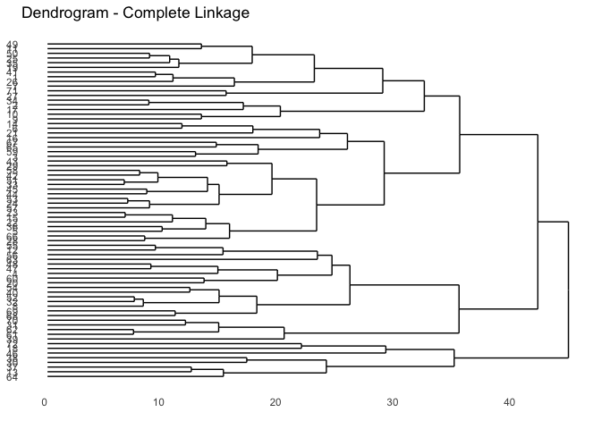

STAT505 Hierarchical Cluster
================
Ramaa Nathan
4/20/2019

-   [Data Exploration](#data-exploration)
    -   [Load File](#load-file)
-   [Hierarchical Clustering](#hierarchical-clustering)
    -   [Complete Linkage](#complete-linkage)

This is a R impelmentation of the hierarchical clustering example used in the on-line notes of STAT 505. This example uses ecological data from Woodyard Hammock, a beech-magnolia forest in northern Florida. The data involve counts of the numbers of trees of each species in n = 72 sites. A total of 31 species were identified and counted, however, only p = 13 of the most common species were retained and are listed below. They are:

| Species Code | Latin Name              | Common Name        |
|--------------|-------------------------|--------------------|
| carcar       | Carpinus caroliniana    | Ironwood           |
| corflo       | Cornus florida          | Dogwood            |
| faggra       | Fagus grandifolia       | Beech              |
| ileopa       | Ilex opaca              | Holly              |
| liqsty       | Liquidambar styraciflua | Sweetgum           |
| maggra       | Magnolia grandiflora    | Magnolia           |
| nyssyl       | Nyssa sylvatica         | Blackgum           |
| ostvir       | Ostrya virginiana       | Blue Beech         |
| oxyarb       | Oxydendrum arboreum     | Sourwood           |
| pingla       | Pinus glabra            | Spruce Pine        |
| quenig       | Quercus nigra           | Water Oak          |
| quemic       | Quercus michauxii       | Swamp Chestnut Oak |
| symtin       | Symplocus tinctoria     | Horse Sugar        |

The objctive of this data is to group sample sites together into clusters that share similar species compositions as determined by some measure of association. In this document, we will be using agglomerative heracrchical clustering techniques.

Data Exploration
----------------

### Load File

``` r
wood = read_table("data/wood.txt", col_names=c("x", "y","acerub","carcar","carcor","cargla","cercan","corflo","faggra","frapen",
  "ileopa", "liqsty","lirtul","maggra","magvir","morrub","nyssyl","osmame","ostvir","oxyarb","pingla","pintae","pruser", "quealb","quehem","quenig",
  "quemic","queshu","quevir","symtin","ulmala","araspi","cyrrac") )
```

    ## Parsed with column specification:
    ## cols(
    ##   .default = col_integer()
    ## )

    ## See spec(...) for full column specifications.

``` r
#Dimensions of the table read in
dim(wood)
```

    ## [1] 72 33

``` r
#We are only interested in 13 species (here they will be considered as 13 variables)
excluded_vars <- c("acerub","carcor","cargla","cercan","frapen","lirtul","magvir","morrub","osmame","pintae","pruser",
                   "quealb","quehem","queshu","quevir","ulmala","araspi","cyrrac")

#Filter out the variables
wood <- wood %>% 
  mutate(ident = row_number()) %>%
  select (-one_of(excluded_vars))

#Check the dimensions and column names of the final dataframe
dim(wood)
```

    ## [1] 72 16

``` r
colnames(wood)
```

    ##  [1] "x"      "y"      "carcar" "corflo" "faggra" "ileopa" "liqsty"
    ##  [8] "maggra" "nyssyl" "ostvir" "oxyarb" "pingla" "quenig" "quemic"
    ## [15] "symtin" "ident"

Hierarchical Clustering
-----------------------

### Complete Linkage

We will use the Euclidean distance as the dissimilarity measure. In R, the dist(<matrix>) fucntion computes the Euclidean distance between the rows of the matrix. In our example, we only want to compute the distances for the 13 variables. So, we will use wood\[,3:15\]

``` r
# we only want to use the columns 3 throught 15 for computing the disimilarities
hc_complete <- hclust(dist(wood[,3:15]),method="complete")

#extract the dendrogram 
hc_complete_den <- as.dendrogram(hc_complete)

# use ggdendrogram (basaed on ggplot2) to plot the dendrograms
ggdendrogram(hc_complete,size=2,rotate=TRUE,scale=2) +
  labs(title="Dendrogram - Complete Linkage") +
  xlab("Height") + ylab("Sites")
```



We want to next find the history of the different merges in forming the different clusters. From the documentation, the order of merges is as follows: Row i of merge describes the merging of clusters at step i of the clustering. If an element j in the row is negative, then observation -j was merged at this stage. If j is positive then the merge was with the cluster formed at the (earlier) stage j of the algorithm. Thus negative entries in merge indicate agglomerations of singletons, and positive entries indicate agglomerations of non-singletons. The Max distance is the maximum distance computed between the two clusters as required for complete linkage

``` r
hc_complete_hist <- as_data_frame(cbind(hc_complete$merge,hc_complete$height))
colnames(hc_complete_hist)<- c("ClusterA","ClusterB","Max Distance")
hc_complete_hist <- hc_complete_hist %>%
  mutate ("Merge Order" = row_number()) %>% 
  select(`Merge Order`, ClusterA, ClusterB, `Max Distance`)
formatAsTable(hc_complete_hist,"Clustering History")
```

<table class="table table-bordered" style="width: auto !important; margin-left: auto; margin-right: auto;">
<thead>
<tr>
<th style="border-bottom:hidden; padding-bottom:0; padding-left:3px;padding-right:3px;text-align: center; " colspan="4">
Clustering History

</th>
</tr>
<tr>
<th style="text-align:right;">
Merge Order
</th>
<th style="text-align:right;">
ClusterA
</th>
<th style="text-align:right;">
ClusterB
</th>
<th style="text-align:right;">
Max Distance
</th>
</tr>
</thead>
<tbody>
<tr>
<td style="text-align:right;">
1
</td>
<td style="text-align:right;">
-33
</td>
<td style="text-align:right;">
-51
</td>
<td style="text-align:right;">
6.557438
</td>
</tr>
<tr>
<td style="text-align:right;">
2
</td>
<td style="text-align:right;">
-15
</td>
<td style="text-align:right;">
-23
</td>
<td style="text-align:right;">
6.633250
</td>
</tr>
<tr>
<td style="text-align:right;">
3
</td>
<td style="text-align:right;">
-24
</td>
<td style="text-align:right;">
-53
</td>
<td style="text-align:right;">
6.855655
</td>
</tr>
<tr>
<td style="text-align:right;">
4
</td>
<td style="text-align:right;">
-61
</td>
<td style="text-align:right;">
-62
</td>
<td style="text-align:right;">
7.348469
</td>
</tr>
<tr>
<td style="text-align:right;">
5
</td>
<td style="text-align:right;">
-32
</td>
<td style="text-align:right;">
-52
</td>
<td style="text-align:right;">
7.416199
</td>
</tr>
<tr>
<td style="text-align:right;">
6
</td>
<td style="text-align:right;">
-42
</td>
<td style="text-align:right;">
-58
</td>
<td style="text-align:right;">
7.874008
</td>
</tr>
<tr>
<td style="text-align:right;">
7
</td>
<td style="text-align:right;">
-8
</td>
<td style="text-align:right;">
5
</td>
<td style="text-align:right;">
8.185353
</td>
</tr>
<tr>
<td style="text-align:right;">
8
</td>
<td style="text-align:right;">
-28
</td>
<td style="text-align:right;">
-66
</td>
<td style="text-align:right;">
8.306624
</td>
</tr>
<tr>
<td style="text-align:right;">
9
</td>
<td style="text-align:right;">
-44
</td>
<td style="text-align:right;">
-45
</td>
<td style="text-align:right;">
8.485281
</td>
</tr>
<tr>
<td style="text-align:right;">
10
</td>
<td style="text-align:right;">
-2
</td>
<td style="text-align:right;">
-34
</td>
<td style="text-align:right;">
8.660254
</td>
</tr>
<tr>
<td style="text-align:right;">
11
</td>
<td style="text-align:right;">
-57
</td>
<td style="text-align:right;">
3
</td>
<td style="text-align:right;">
8.717798
</td>
</tr>
<tr>
<td style="text-align:right;">
12
</td>
<td style="text-align:right;">
-25
</td>
<td style="text-align:right;">
-50
</td>
<td style="text-align:right;">
8.717798
</td>
</tr>
<tr>
<td style="text-align:right;">
13
</td>
<td style="text-align:right;">
-47
</td>
<td style="text-align:right;">
-48
</td>
<td style="text-align:right;">
8.831761
</td>
</tr>
<tr>
<td style="text-align:right;">
14
</td>
<td style="text-align:right;">
-1
</td>
<td style="text-align:right;">
-41
</td>
<td style="text-align:right;">
9.219544
</td>
</tr>
<tr>
<td style="text-align:right;">
15
</td>
<td style="text-align:right;">
-12
</td>
<td style="text-align:right;">
-55
</td>
<td style="text-align:right;">
9.219544
</td>
</tr>
<tr>
<td style="text-align:right;">
16
</td>
<td style="text-align:right;">
1
</td>
<td style="text-align:right;">
6
</td>
<td style="text-align:right;">
9.433981
</td>
</tr>
<tr>
<td style="text-align:right;">
17
</td>
<td style="text-align:right;">
-5
</td>
<td style="text-align:right;">
-36
</td>
<td style="text-align:right;">
9.797959
</td>
</tr>
<tr>
<td style="text-align:right;">
18
</td>
<td style="text-align:right;">
-35
</td>
<td style="text-align:right;">
12
</td>
<td style="text-align:right;">
10.440307
</td>
</tr>
<tr>
<td style="text-align:right;">
19
</td>
<td style="text-align:right;">
-22
</td>
<td style="text-align:right;">
2
</td>
<td style="text-align:right;">
10.677078
</td>
</tr>
<tr>
<td style="text-align:right;">
20
</td>
<td style="text-align:right;">
-26
</td>
<td style="text-align:right;">
14
</td>
<td style="text-align:right;">
10.723805
</td>
</tr>
<tr>
<td style="text-align:right;">
21
</td>
<td style="text-align:right;">
-68
</td>
<td style="text-align:right;">
-69
</td>
<td style="text-align:right;">
10.908712
</td>
</tr>
<tr>
<td style="text-align:right;">
22
</td>
<td style="text-align:right;">
-19
</td>
<td style="text-align:right;">
18
</td>
<td style="text-align:right;">
11.224972
</td>
</tr>
<tr>
<td style="text-align:right;">
23
</td>
<td style="text-align:right;">
-6
</td>
<td style="text-align:right;">
-14
</td>
<td style="text-align:right;">
11.489125
</td>
</tr>
<tr>
<td style="text-align:right;">
24
</td>
<td style="text-align:right;">
-31
</td>
<td style="text-align:right;">
-70
</td>
<td style="text-align:right;">
11.789826
</td>
</tr>
<tr>
<td style="text-align:right;">
25
</td>
<td style="text-align:right;">
-40
</td>
<td style="text-align:right;">
-54
</td>
<td style="text-align:right;">
12.165525
</td>
</tr>
<tr>
<td style="text-align:right;">
26
</td>
<td style="text-align:right;">
-13
</td>
<td style="text-align:right;">
-37
</td>
<td style="text-align:right;">
12.288206
</td>
</tr>
<tr>
<td style="text-align:right;">
27
</td>
<td style="text-align:right;">
-3
</td>
<td style="text-align:right;">
-59
</td>
<td style="text-align:right;">
12.649111
</td>
</tr>
<tr>
<td style="text-align:right;">
28
</td>
<td style="text-align:right;">
-9
</td>
<td style="text-align:right;">
-10
</td>
<td style="text-align:right;">
13.152946
</td>
</tr>
<tr>
<td style="text-align:right;">
29
</td>
<td style="text-align:right;">
-11
</td>
<td style="text-align:right;">
-49
</td>
<td style="text-align:right;">
13.152946
</td>
</tr>
<tr>
<td style="text-align:right;">
30
</td>
<td style="text-align:right;">
-20
</td>
<td style="text-align:right;">
-60
</td>
<td style="text-align:right;">
13.379088
</td>
</tr>
<tr>
<td style="text-align:right;">
31
</td>
<td style="text-align:right;">
17
</td>
<td style="text-align:right;">
19
</td>
<td style="text-align:right;">
13.527749
</td>
</tr>
<tr>
<td style="text-align:right;">
32
</td>
<td style="text-align:right;">
9
</td>
<td style="text-align:right;">
16
</td>
<td style="text-align:right;">
13.674794
</td>
</tr>
<tr>
<td style="text-align:right;">
33
</td>
<td style="text-align:right;">
-65
</td>
<td style="text-align:right;">
-67
</td>
<td style="text-align:right;">
14.422205
</td>
</tr>
<tr>
<td style="text-align:right;">
34
</td>
<td style="text-align:right;">
-4
</td>
<td style="text-align:right;">
13
</td>
<td style="text-align:right;">
14.560220
</td>
</tr>
<tr>
<td style="text-align:right;">
35
</td>
<td style="text-align:right;">
4
</td>
<td style="text-align:right;">
24
</td>
<td style="text-align:right;">
14.628739
</td>
</tr>
<tr>
<td style="text-align:right;">
36
</td>
<td style="text-align:right;">
7
</td>
<td style="text-align:right;">
25
</td>
<td style="text-align:right;">
14.662878
</td>
</tr>
<tr>
<td style="text-align:right;">
37
</td>
<td style="text-align:right;">
11
</td>
<td style="text-align:right;">
32
</td>
<td style="text-align:right;">
14.662878
</td>
</tr>
<tr>
<td style="text-align:right;">
38
</td>
<td style="text-align:right;">
-56
</td>
<td style="text-align:right;">
15
</td>
<td style="text-align:right;">
15.000000
</td>
</tr>
<tr>
<td style="text-align:right;">
39
</td>
<td style="text-align:right;">
-64
</td>
<td style="text-align:right;">
26
</td>
<td style="text-align:right;">
15.033296
</td>
</tr>
<tr>
<td style="text-align:right;">
40
</td>
<td style="text-align:right;">
-27
</td>
<td style="text-align:right;">
-71
</td>
<td style="text-align:right;">
15.264337
</td>
</tr>
<tr>
<td style="text-align:right;">
41
</td>
<td style="text-align:right;">
-29
</td>
<td style="text-align:right;">
-43
</td>
<td style="text-align:right;">
15.329710
</td>
</tr>
<tr>
<td style="text-align:right;">
42
</td>
<td style="text-align:right;">
8
</td>
<td style="text-align:right;">
31
</td>
<td style="text-align:right;">
15.556349
</td>
</tr>
<tr>
<td style="text-align:right;">
43
</td>
<td style="text-align:right;">
-7
</td>
<td style="text-align:right;">
20
</td>
<td style="text-align:right;">
15.968719
</td>
</tr>
<tr>
<td style="text-align:right;">
44
</td>
<td style="text-align:right;">
-17
</td>
<td style="text-align:right;">
10
</td>
<td style="text-align:right;">
16.733200
</td>
</tr>
<tr>
<td style="text-align:right;">
45
</td>
<td style="text-align:right;">
-30
</td>
<td style="text-align:right;">
-38
</td>
<td style="text-align:right;">
17.029386
</td>
</tr>
<tr>
<td style="text-align:right;">
46
</td>
<td style="text-align:right;">
22
</td>
<td style="text-align:right;">
29
</td>
<td style="text-align:right;">
17.492856
</td>
</tr>
<tr>
<td style="text-align:right;">
47
</td>
<td style="text-align:right;">
-21
</td>
<td style="text-align:right;">
23
</td>
<td style="text-align:right;">
17.549929
</td>
</tr>
<tr>
<td style="text-align:right;">
48
</td>
<td style="text-align:right;">
21
</td>
<td style="text-align:right;">
36
</td>
<td style="text-align:right;">
17.888544
</td>
</tr>
<tr>
<td style="text-align:right;">
49
</td>
<td style="text-align:right;">
27
</td>
<td style="text-align:right;">
33
</td>
<td style="text-align:right;">
18.000000
</td>
</tr>
<tr>
<td style="text-align:right;">
50
</td>
<td style="text-align:right;">
37
</td>
<td style="text-align:right;">
41
</td>
<td style="text-align:right;">
19.183326
</td>
</tr>
<tr>
<td style="text-align:right;">
51
</td>
<td style="text-align:right;">
30
</td>
<td style="text-align:right;">
34
</td>
<td style="text-align:right;">
19.646883
</td>
</tr>
<tr>
<td style="text-align:right;">
52
</td>
<td style="text-align:right;">
28
</td>
<td style="text-align:right;">
44
</td>
<td style="text-align:right;">
19.899749
</td>
</tr>
<tr>
<td style="text-align:right;">
53
</td>
<td style="text-align:right;">
-39
</td>
<td style="text-align:right;">
35
</td>
<td style="text-align:right;">
20.223748
</td>
</tr>
<tr>
<td style="text-align:right;">
54
</td>
<td style="text-align:right;">
-18
</td>
<td style="text-align:right;">
-72
</td>
<td style="text-align:right;">
21.702534
</td>
</tr>
<tr>
<td style="text-align:right;">
55
</td>
<td style="text-align:right;">
43
</td>
<td style="text-align:right;">
46
</td>
<td style="text-align:right;">
22.803508
</td>
</tr>
<tr>
<td style="text-align:right;">
56
</td>
<td style="text-align:right;">
42
</td>
<td style="text-align:right;">
50
</td>
<td style="text-align:right;">
23.000000
</td>
</tr>
<tr>
<td style="text-align:right;">
57
</td>
<td style="text-align:right;">
-63
</td>
<td style="text-align:right;">
38
</td>
<td style="text-align:right;">
23.065125
</td>
</tr>
<tr>
<td style="text-align:right;">
58
</td>
<td style="text-align:right;">
-16
</td>
<td style="text-align:right;">
47
</td>
<td style="text-align:right;">
23.259407
</td>
</tr>
<tr>
<td style="text-align:right;">
59
</td>
<td style="text-align:right;">
39
</td>
<td style="text-align:right;">
45
</td>
<td style="text-align:right;">
23.832751
</td>
</tr>
<tr>
<td style="text-align:right;">
60
</td>
<td style="text-align:right;">
51
</td>
<td style="text-align:right;">
57
</td>
<td style="text-align:right;">
24.310492
</td>
</tr>
<tr>
<td style="text-align:right;">
61
</td>
<td style="text-align:right;">
49
</td>
<td style="text-align:right;">
58
</td>
<td style="text-align:right;">
25.632011
</td>
</tr>
<tr>
<td style="text-align:right;">
62
</td>
<td style="text-align:right;">
48
</td>
<td style="text-align:right;">
60
</td>
<td style="text-align:right;">
25.845696
</td>
</tr>
<tr>
<td style="text-align:right;">
63
</td>
<td style="text-align:right;">
40
</td>
<td style="text-align:right;">
55
</td>
<td style="text-align:right;">
28.653098
</td>
</tr>
<tr>
<td style="text-align:right;">
64
</td>
<td style="text-align:right;">
56
</td>
<td style="text-align:right;">
61
</td>
<td style="text-align:right;">
28.774989
</td>
</tr>
<tr>
<td style="text-align:right;">
65
</td>
<td style="text-align:right;">
-46
</td>
<td style="text-align:right;">
54
</td>
<td style="text-align:right;">
28.913665
</td>
</tr>
<tr>
<td style="text-align:right;">
66
</td>
<td style="text-align:right;">
52
</td>
<td style="text-align:right;">
63
</td>
<td style="text-align:right;">
32.202484
</td>
</tr>
<tr>
<td style="text-align:right;">
67
</td>
<td style="text-align:right;">
59
</td>
<td style="text-align:right;">
65
</td>
<td style="text-align:right;">
34.756294
</td>
</tr>
<tr>
<td style="text-align:right;">
68
</td>
<td style="text-align:right;">
53
</td>
<td style="text-align:right;">
62
</td>
<td style="text-align:right;">
35.171011
</td>
</tr>
<tr>
<td style="text-align:right;">
69
</td>
<td style="text-align:right;">
64
</td>
<td style="text-align:right;">
66
</td>
<td style="text-align:right;">
35.227830
</td>
</tr>
<tr>
<td style="text-align:right;">
70
</td>
<td style="text-align:right;">
68
</td>
<td style="text-align:right;">
69
</td>
<td style="text-align:right;">
41.904654
</td>
</tr>
<tr>
<td style="text-align:right;">
71
</td>
<td style="text-align:right;">
67
</td>
<td style="text-align:right;">
70
</td>
<td style="text-align:right;">
44.519659
</td>
</tr>
</tbody>
</table>
Cluster numbers

``` r
hc_complete_clusters = as_data_frame(cbind(wood$ident,cutree(hc_complete, k=6)))
colnames(hc_complete_clusters) <- c("Identity","Cluster")
formatAsTable(hc_complete_clusters,"Clusters")
```

<table class="table table-bordered" style="width: auto !important; margin-left: auto; margin-right: auto;">
<thead>
<tr>
<th style="border-bottom:hidden; padding-bottom:0; padding-left:3px;padding-right:3px;text-align: center; " colspan="2">
Clusters

</th>
</tr>
<tr>
<th style="text-align:right;">
Identity
</th>
<th style="text-align:right;">
Cluster
</th>
</tr>
</thead>
<tbody>
<tr>
<td style="text-align:right;">
1
</td>
<td style="text-align:right;">
1
</td>
</tr>
<tr>
<td style="text-align:right;">
2
</td>
<td style="text-align:right;">
1
</td>
</tr>
<tr>
<td style="text-align:right;">
3
</td>
<td style="text-align:right;">
2
</td>
</tr>
<tr>
<td style="text-align:right;">
4
</td>
<td style="text-align:right;">
3
</td>
</tr>
<tr>
<td style="text-align:right;">
5
</td>
<td style="text-align:right;">
2
</td>
</tr>
<tr>
<td style="text-align:right;">
6
</td>
<td style="text-align:right;">
2
</td>
</tr>
<tr>
<td style="text-align:right;">
7
</td>
<td style="text-align:right;">
1
</td>
</tr>
<tr>
<td style="text-align:right;">
8
</td>
<td style="text-align:right;">
3
</td>
</tr>
<tr>
<td style="text-align:right;">
9
</td>
<td style="text-align:right;">
1
</td>
</tr>
<tr>
<td style="text-align:right;">
10
</td>
<td style="text-align:right;">
1
</td>
</tr>
<tr>
<td style="text-align:right;">
11
</td>
<td style="text-align:right;">
1
</td>
</tr>
<tr>
<td style="text-align:right;">
12
</td>
<td style="text-align:right;">
3
</td>
</tr>
<tr>
<td style="text-align:right;">
13
</td>
<td style="text-align:right;">
4
</td>
</tr>
<tr>
<td style="text-align:right;">
14
</td>
<td style="text-align:right;">
2
</td>
</tr>
<tr>
<td style="text-align:right;">
15
</td>
<td style="text-align:right;">
2
</td>
</tr>
<tr>
<td style="text-align:right;">
16
</td>
<td style="text-align:right;">
2
</td>
</tr>
<tr>
<td style="text-align:right;">
17
</td>
<td style="text-align:right;">
1
</td>
</tr>
<tr>
<td style="text-align:right;">
18
</td>
<td style="text-align:right;">
5
</td>
</tr>
<tr>
<td style="text-align:right;">
19
</td>
<td style="text-align:right;">
1
</td>
</tr>
<tr>
<td style="text-align:right;">
20
</td>
<td style="text-align:right;">
3
</td>
</tr>
<tr>
<td style="text-align:right;">
21
</td>
<td style="text-align:right;">
2
</td>
</tr>
<tr>
<td style="text-align:right;">
22
</td>
<td style="text-align:right;">
2
</td>
</tr>
<tr>
<td style="text-align:right;">
23
</td>
<td style="text-align:right;">
2
</td>
</tr>
<tr>
<td style="text-align:right;">
24
</td>
<td style="text-align:right;">
2
</td>
</tr>
<tr>
<td style="text-align:right;">
25
</td>
<td style="text-align:right;">
1
</td>
</tr>
<tr>
<td style="text-align:right;">
26
</td>
<td style="text-align:right;">
1
</td>
</tr>
<tr>
<td style="text-align:right;">
27
</td>
<td style="text-align:right;">
1
</td>
</tr>
<tr>
<td style="text-align:right;">
28
</td>
<td style="text-align:right;">
2
</td>
</tr>
<tr>
<td style="text-align:right;">
29
</td>
<td style="text-align:right;">
2
</td>
</tr>
<tr>
<td style="text-align:right;">
30
</td>
<td style="text-align:right;">
4
</td>
</tr>
<tr>
<td style="text-align:right;">
31
</td>
<td style="text-align:right;">
6
</td>
</tr>
<tr>
<td style="text-align:right;">
32
</td>
<td style="text-align:right;">
3
</td>
</tr>
<tr>
<td style="text-align:right;">
33
</td>
<td style="text-align:right;">
2
</td>
</tr>
<tr>
<td style="text-align:right;">
34
</td>
<td style="text-align:right;">
1
</td>
</tr>
<tr>
<td style="text-align:right;">
35
</td>
<td style="text-align:right;">
1
</td>
</tr>
<tr>
<td style="text-align:right;">
36
</td>
<td style="text-align:right;">
2
</td>
</tr>
<tr>
<td style="text-align:right;">
37
</td>
<td style="text-align:right;">
4
</td>
</tr>
<tr>
<td style="text-align:right;">
38
</td>
<td style="text-align:right;">
4
</td>
</tr>
<tr>
<td style="text-align:right;">
39
</td>
<td style="text-align:right;">
6
</td>
</tr>
<tr>
<td style="text-align:right;">
40
</td>
<td style="text-align:right;">
3
</td>
</tr>
<tr>
<td style="text-align:right;">
41
</td>
<td style="text-align:right;">
1
</td>
</tr>
<tr>
<td style="text-align:right;">
42
</td>
<td style="text-align:right;">
2
</td>
</tr>
<tr>
<td style="text-align:right;">
43
</td>
<td style="text-align:right;">
2
</td>
</tr>
<tr>
<td style="text-align:right;">
44
</td>
<td style="text-align:right;">
2
</td>
</tr>
<tr>
<td style="text-align:right;">
45
</td>
<td style="text-align:right;">
2
</td>
</tr>
<tr>
<td style="text-align:right;">
46
</td>
<td style="text-align:right;">
5
</td>
</tr>
<tr>
<td style="text-align:right;">
47
</td>
<td style="text-align:right;">
3
</td>
</tr>
<tr>
<td style="text-align:right;">
48
</td>
<td style="text-align:right;">
3
</td>
</tr>
<tr>
<td style="text-align:right;">
49
</td>
<td style="text-align:right;">
1
</td>
</tr>
<tr>
<td style="text-align:right;">
50
</td>
<td style="text-align:right;">
1
</td>
</tr>
<tr>
<td style="text-align:right;">
51
</td>
<td style="text-align:right;">
2
</td>
</tr>
<tr>
<td style="text-align:right;">
52
</td>
<td style="text-align:right;">
3
</td>
</tr>
<tr>
<td style="text-align:right;">
53
</td>
<td style="text-align:right;">
2
</td>
</tr>
<tr>
<td style="text-align:right;">
54
</td>
<td style="text-align:right;">
3
</td>
</tr>
<tr>
<td style="text-align:right;">
55
</td>
<td style="text-align:right;">
3
</td>
</tr>
<tr>
<td style="text-align:right;">
56
</td>
<td style="text-align:right;">
3
</td>
</tr>
<tr>
<td style="text-align:right;">
57
</td>
<td style="text-align:right;">
2
</td>
</tr>
<tr>
<td style="text-align:right;">
58
</td>
<td style="text-align:right;">
2
</td>
</tr>
<tr>
<td style="text-align:right;">
59
</td>
<td style="text-align:right;">
2
</td>
</tr>
<tr>
<td style="text-align:right;">
60
</td>
<td style="text-align:right;">
3
</td>
</tr>
<tr>
<td style="text-align:right;">
61
</td>
<td style="text-align:right;">
6
</td>
</tr>
<tr>
<td style="text-align:right;">
62
</td>
<td style="text-align:right;">
6
</td>
</tr>
<tr>
<td style="text-align:right;">
63
</td>
<td style="text-align:right;">
3
</td>
</tr>
<tr>
<td style="text-align:right;">
64
</td>
<td style="text-align:right;">
4
</td>
</tr>
<tr>
<td style="text-align:right;">
65
</td>
<td style="text-align:right;">
2
</td>
</tr>
<tr>
<td style="text-align:right;">
66
</td>
<td style="text-align:right;">
2
</td>
</tr>
<tr>
<td style="text-align:right;">
67
</td>
<td style="text-align:right;">
2
</td>
</tr>
<tr>
<td style="text-align:right;">
68
</td>
<td style="text-align:right;">
3
</td>
</tr>
<tr>
<td style="text-align:right;">
69
</td>
<td style="text-align:right;">
3
</td>
</tr>
<tr>
<td style="text-align:right;">
70
</td>
<td style="text-align:right;">
6
</td>
</tr>
<tr>
<td style="text-align:right;">
71
</td>
<td style="text-align:right;">
1
</td>
</tr>
<tr>
<td style="text-align:right;">
72
</td>
<td style="text-align:right;">
5
</td>
</tr>
</tbody>
</table>
Interpret the Clusters by doing an ANOVA on all the variables

``` r
wood_cluster <- wood %>% mutate(cluster = cutree(hc_complete,k=6))

# WE could do an ANOVA fit with one model statement - but it is difficult to extract the individual p-values.
manova_fit <- manova(cbind(carcar, corflo, faggra, ileopa, liqsty, maggra, nyssyl, ostvir, oxyarb, 
     pingla,quenig, quemic, symtin) ~ factor(cluster), data=wood_cluster)
str(summary.aov(manova_fit))
```

    ## List of 13
    ##  $  Response carcar:Classes 'anova' and 'data.frame':    2 obs. of  5 variables:
    ##   ..$ Df     : num [1:2] 5 66
    ##   ..$ Sum Sq : num [1:2] 4341 910
    ##   ..$ Mean Sq: num [1:2] 868.2 13.8
    ##   ..$ F value: num [1:2] 62.9 NA
    ##   ..$ Pr(>F) : num [1:2] 8.81e-24 NA
    ##  $  Response corflo:Classes 'anova' and 'data.frame':    2 obs. of  5 variables:
    ##   ..$ Df     : num [1:2] 5 66
    ##   ..$ Sum Sq : num [1:2] 32.7 278.6
    ##   ..$ Mean Sq: num [1:2] 6.54 4.22
    ##   ..$ F value: num [1:2] 1.55 NA
    ##   ..$ Pr(>F) : num [1:2] 0.187 NA
    ##  $  Response faggra:Classes 'anova' and 'data.frame':    2 obs. of  5 variables:
    ##   ..$ Df     : num [1:2] 5 66
    ##   ..$ Sum Sq : num [1:2] 538 999
    ##   ..$ Mean Sq: num [1:2] 107.6 15.1
    ##   ..$ F value: num [1:2] 7.11 NA
    ##   ..$ Pr(>F) : num [1:2] 2.27e-05 NA
    ##  $  Response ileopa:Classes 'anova' and 'data.frame':    2 obs. of  5 variables:
    ##   ..$ Df     : num [1:2] 5 66
    ##   ..$ Sum Sq : num [1:2] 480 1850
    ##   ..$ Mean Sq: num [1:2] 96 28
    ##   ..$ F value: num [1:2] 3.42 NA
    ##   ..$ Pr(>F) : num [1:2] 0.00824 NA
    ##  $  Response liqsty:Classes 'anova' and 'data.frame':    2 obs. of  5 variables:
    ##   ..$ Df     : num [1:2] 5 66
    ##   ..$ Sum Sq : num [1:2] 833 1875
    ##   ..$ Mean Sq: num [1:2] 166.7 28.4
    ##   ..$ F value: num [1:2] 5.87 NA
    ##   ..$ Pr(>F) : num [1:2] 0.000152 NA
    ##  $  Response maggra:Classes 'anova' and 'data.frame':    2 obs. of  5 variables:
    ##   ..$ Df     : num [1:2] 5 66
    ##   ..$ Sum Sq : num [1:2] 111 370
    ##   ..$ Mean Sq: num [1:2] 22.3 5.6
    ##   ..$ F value: num [1:2] 3.97 NA
    ##   ..$ Pr(>F) : num [1:2] 0.00329 NA
    ##  $  Response nyssyl:Classes 'anova' and 'data.frame':    2 obs. of  5 variables:
    ##   ..$ Df     : num [1:2] 5 66
    ##   ..$ Sum Sq : num [1:2] 36.7 292.1
    ##   ..$ Mean Sq: num [1:2] 7.35 4.43
    ##   ..$ F value: num [1:2] 1.66 NA
    ##   ..$ Pr(>F) : num [1:2] 0.157 NA
    ##  $  Response ostvir:Classes 'anova' and 'data.frame':    2 obs. of  5 variables:
    ##   ..$ Df     : num [1:2] 5 66
    ##   ..$ Sum Sq : num [1:2] 1531 1141
    ##   ..$ Mean Sq: num [1:2] 306.1 17.3
    ##   ..$ F value: num [1:2] 17.7 NA
    ##   ..$ Pr(>F) : num [1:2] 4.35e-11 NA
    ##  $  Response oxyarb:Classes 'anova' and 'data.frame':    2 obs. of  5 variables:
    ##   ..$ Df     : num [1:2] 5 66
    ##   ..$ Sum Sq : num [1:2] 34.4 320.2
    ##   ..$ Mean Sq: num [1:2] 6.88 4.85
    ##   ..$ F value: num [1:2] 1.42 NA
    ##   ..$ Pr(>F) : num [1:2] 0.229 NA
    ##  $  Response pingla:Classes 'anova' and 'data.frame':    2 obs. of  5 variables:
    ##   ..$ Df     : num [1:2] 5 66
    ##   ..$ Sum Sq : num [1:2] 39.6 1209.9
    ##   ..$ Mean Sq: num [1:2] 7.93 18.33
    ##   ..$ F value: num [1:2] 0.432 NA
    ##   ..$ Pr(>F) : num [1:2] 0.824 NA
    ##  $  Response quenig:Classes 'anova' and 'data.frame':    2 obs. of  5 variables:
    ##   ..$ Df     : num [1:2] 5 66
    ##   ..$ Sum Sq : num [1:2] 65 384
    ##   ..$ Mean Sq: num [1:2] 13.01 5.83
    ##   ..$ F value: num [1:2] 2.23 NA
    ##   ..$ Pr(>F) : num [1:2] 0.0612 NA
    ##  $  Response quemic:Classes 'anova' and 'data.frame':    2 obs. of  5 variables:
    ##   ..$ Df     : num [1:2] 5 66
    ##   ..$ Sum Sq : num [1:2] 304 974
    ##   ..$ Mean Sq: num [1:2] 60.8 14.8
    ##   ..$ F value: num [1:2] 4.12 NA
    ##   ..$ Pr(>F) : num [1:2] 0.00256 NA
    ##  $  Response symtin:Classes 'anova' and 'data.frame':    2 obs. of  5 variables:
    ##   ..$ Df     : num [1:2] 5 66
    ##   ..$ Sum Sq : num [1:2] 2252 393
    ##   ..$ Mean Sq: num [1:2] 450.32 5.96
    ##   ..$ F value: num [1:2] 75.6 NA
    ##   ..$ Pr(>F) : num [1:2] 5.79e-26 NA
    ##  - attr(*, "class")= chr [1:2] "summary.aov" "listof"

``` r
# So, do a separate anova for each response variable and create a list of the fits
fitlist = sapply(wood_cluster[,3:15],function(resp) summary(aov(resp ~ factor(cluster), data=wood_cluster)))
response_names <- names(fitlist)
str(fitlist[[1]]["Pr(>F)"])
```

    ## Classes 'anova' and 'data.frame':    2 obs. of  1 variable:
    ##  $ Pr(>F): num  8.81e-24 NA

``` r
sig_responses = NULL
for(l in seq_along(fitlist)) {
  #print(fitlist[l])
  if(fitlist[[l]]$"Pr(>F)"[1] < (0.05/13)) {
    print(paste(response_names[l],": ",fitlist[[l]]$"Pr(>F)"[1]))
    sig_responses = append(sig_responses,response_names[l])
  }
}
```

    ## [1] "carcar :  8.80852922183047e-24"
    ## [1] "faggra :  2.27190383668137e-05"
    ## [1] "liqsty :  0.000152444655166322"
    ## [1] "maggra :  0.00328752181365586"
    ## [1] "ostvir :  4.35436167576968e-11"
    ## [1] "quemic :  0.0025566026778279"
    ## [1] "symtin :  5.79053974855473e-26"

``` r
#sig_responses
paste("Significant Variables:")
```

    ## [1] "Significant Variables:"

``` r
sig_responses
```

    ## [1] "carcar" "faggra" "liqsty" "maggra" "ostvir" "quemic" "symtin"

Get the cluster means of only the significant response variables

``` r
cluster_means <- wood_cluster %>% group_by(cluster) %>% summarise_at(vars(sig_responses),mean)
formatAsTable(cluster_means,"Cluster Means of Significant Variables")
```

<table class="table table-bordered" style="width: auto !important; margin-left: auto; margin-right: auto;">
<thead>
<tr>
<th style="border-bottom:hidden; padding-bottom:0; padding-left:3px;padding-right:3px;text-align: center; " colspan="8">
Cluster Means of Significant Variables

</th>
</tr>
<tr>
<th style="text-align:right;">
cluster
</th>
<th style="text-align:right;">
carcar
</th>
<th style="text-align:right;">
faggra
</th>
<th style="text-align:right;">
liqsty
</th>
<th style="text-align:right;">
maggra
</th>
<th style="text-align:right;">
ostvir
</th>
<th style="text-align:right;">
quemic
</th>
<th style="text-align:right;">
symtin
</th>
</tr>
</thead>
<tbody>
<tr>
<td style="text-align:right;">
1
</td>
<td style="text-align:right;">
1.235294
</td>
<td style="text-align:right;">
5.941177
</td>
<td style="text-align:right;">
6.764706
</td>
<td style="text-align:right;">
3.2352941
</td>
<td style="text-align:right;">
13.823529
</td>
<td style="text-align:right;">
4.117647
</td>
<td style="text-align:right;">
2.0000000
</td>
</tr>
<tr>
<td style="text-align:right;">
2
</td>
<td style="text-align:right;">
3.846154
</td>
<td style="text-align:right;">
11.384615
</td>
<td style="text-align:right;">
7.192308
</td>
<td style="text-align:right;">
5.2692308
</td>
<td style="text-align:right;">
4.269231
</td>
<td style="text-align:right;">
5.269231
</td>
<td style="text-align:right;">
0.9230769
</td>
</tr>
<tr>
<td style="text-align:right;">
3
</td>
<td style="text-align:right;">
18.500000
</td>
<td style="text-align:right;">
5.937500
</td>
<td style="text-align:right;">
6.437500
</td>
<td style="text-align:right;">
2.7500000
</td>
<td style="text-align:right;">
2.875000
</td>
<td style="text-align:right;">
9.375000
</td>
<td style="text-align:right;">
0.6875000
</td>
</tr>
<tr>
<td style="text-align:right;">
4
</td>
<td style="text-align:right;">
8.200000
</td>
<td style="text-align:right;">
8.600000
</td>
<td style="text-align:right;">
6.600000
</td>
<td style="text-align:right;">
4.6000000
</td>
<td style="text-align:right;">
3.600000
</td>
<td style="text-align:right;">
7.000000
</td>
<td style="text-align:right;">
18.0000000
</td>
</tr>
<tr>
<td style="text-align:right;">
5
</td>
<td style="text-align:right;">
6.000000
</td>
<td style="text-align:right;">
2.666667
</td>
<td style="text-align:right;">
18.000000
</td>
<td style="text-align:right;">
0.6666667
</td>
<td style="text-align:right;">
14.000000
</td>
<td style="text-align:right;">
2.333333
</td>
<td style="text-align:right;">
20.0000000
</td>
</tr>
<tr>
<td style="text-align:right;">
6
</td>
<td style="text-align:right;">
24.400000
</td>
<td style="text-align:right;">
6.400000
</td>
<td style="text-align:right;">
17.400000
</td>
<td style="text-align:right;">
3.8000000
</td>
<td style="text-align:right;">
2.800000
</td>
<td style="text-align:right;">
5.200000
</td>
<td style="text-align:right;">
0.0000000
</td>
</tr>
</tbody>
</table>
